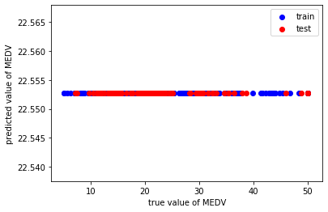
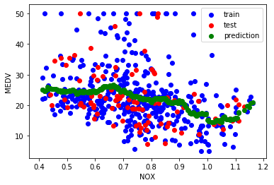
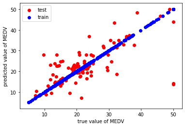
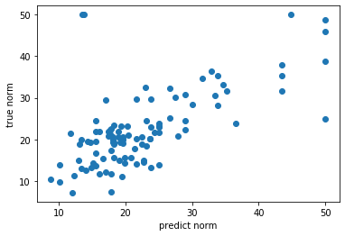
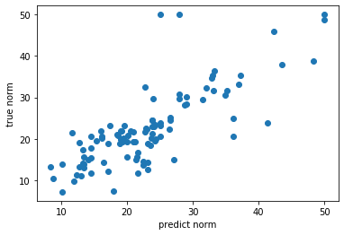
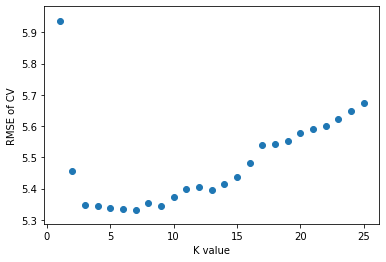
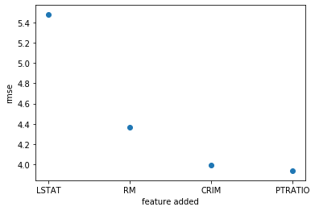

# Problem Set 3, due October 1 at 11:59pm.

### Before You Start

Make sure the following libraries load correctly (hit Ctrl-Enter). Note that while you are loading several powerful libraries, including machine learning libraries, the goal of this problem set is to implement several algorithms from scratch. In particular, you should *not* be using any built-in libraries for nearest neighbors, distance metrics, or cross-validation -- your mission is to write those algorithms in Python! Part 1 will be relatively easy; Part 2 will take more time.


```python
import IPython
import numpy as np
import scipy as sp
import pandas as pd
import matplotlib
import sklearn
import matplotlib.pyplot as plt
import time
```

---

## Introduction to the assignment

For this assignment, you will be using the [Boston Housing Prices Data Set](http://www.kellogg.northwestern.edu/faculty/weber/emp/_session_3/boston.htm).  Please read about the dataset carefully before continuing.  Use the following commands to load the dataset:


```python
# load Boston housing data set
data = np.loadtxt('data.txt')
target = np.loadtxt('target.txt')
```


```python
bdata = pd.DataFrame(data)
btarget = pd.DataFrame(target)
boston = pd.concat([bdata,btarget],axis = 1)
boston.columns = ['CRIM','ZN','INDUS','CHAS','NOX','RM','AGE','DIS','RAD','TAX','PTRATIO','B','LSTAT','MEDV']
```


```python
boston.head()
```


<div>
<style scoped>
    .dataframe tbody tr th:only-of-type {
        vertical-align: middle;
    }

    .dataframe tbody tr th {
        vertical-align: top;
    }

    .dataframe thead th {
        text-align: right;
    }
</style>
<table border="1" class="dataframe">
  <thead>
    <tr style="text-align: right;">
      <th></th>
      <th>CRIM</th>
      <th>ZN</th>
      <th>INDUS</th>
      <th>CHAS</th>
      <th>NOX</th>
      <th>RM</th>
      <th>AGE</th>
      <th>DIS</th>
      <th>RAD</th>
      <th>TAX</th>
      <th>PTRATIO</th>
      <th>B</th>
      <th>LSTAT</th>
      <th>MEDV</th>
    </tr>
  </thead>
  <tbody>
    <tr>
      <td>0</td>
      <td>0.218960</td>
      <td>18.0</td>
      <td>2.629288</td>
      <td>0.0</td>
      <td>0.869420</td>
      <td>6.875396</td>
      <td>65.2</td>
      <td>4.347275</td>
      <td>1.0</td>
      <td>307.0</td>
      <td>15.534711</td>
      <td>397.462329</td>
      <td>5.715647</td>
      <td>24.0</td>
    </tr>
    <tr>
      <td>1</td>
      <td>0.141576</td>
      <td>0.0</td>
      <td>7.315612</td>
      <td>0.0</td>
      <td>0.549711</td>
      <td>6.499894</td>
      <td>78.9</td>
      <td>5.315684</td>
      <td>2.0</td>
      <td>255.0</td>
      <td>17.914131</td>
      <td>397.012611</td>
      <td>9.338417</td>
      <td>21.6</td>
    </tr>
    <tr>
      <td>2</td>
      <td>0.380457</td>
      <td>0.0</td>
      <td>7.340354</td>
      <td>0.0</td>
      <td>0.697928</td>
      <td>7.263489</td>
      <td>61.1</td>
      <td>5.356935</td>
      <td>2.0</td>
      <td>243.0</td>
      <td>17.919989</td>
      <td>396.628236</td>
      <td>4.142473</td>
      <td>34.7</td>
    </tr>
    <tr>
      <td>3</td>
      <td>0.313563</td>
      <td>0.0</td>
      <td>2.562407</td>
      <td>0.0</td>
      <td>0.599629</td>
      <td>7.209732</td>
      <td>45.8</td>
      <td>6.103983</td>
      <td>3.0</td>
      <td>226.0</td>
      <td>18.979527</td>
      <td>398.564784</td>
      <td>3.239272</td>
      <td>33.4</td>
    </tr>
    <tr>
      <td>4</td>
      <td>0.330105</td>
      <td>0.0</td>
      <td>2.497337</td>
      <td>0.0</td>
      <td>0.476077</td>
      <td>7.184111</td>
      <td>54.2</td>
      <td>6.264372</td>
      <td>3.0</td>
      <td>234.0</td>
      <td>18.708888</td>
      <td>399.487766</td>
      <td>6.115159</td>
      <td>36.2</td>
    </tr>
  </tbody>
</table>
</div>


## Side note: 
You can use the IPython to easily debug your code. Just add the line IPython.embed() as a break point at some place in
your code and it will give you access to a Python terminal where you can view the values that specific variables get, their dimensions etc. The pdb package in Python is also similar to IPython. 

---

## Part 1: Experimental Setup

The goal of the next few sections is to design an experiment to predict the median home value for an instance in the data.
Before beginning the "real" work, refamiliarize yourself with the dataset.

### 1.1 Begin by writing a function to compute the Root Mean Squared Error for a list of numbers

You can find the sqrt function in the Numpy package. Furthermore the details of RMSE can be found on [Wikipedia](http://en.wikipedia.org/wiki/Root-mean-square_deviation). Do not use a built-in function (other than sqrt) to compute RMSE.


```python
"""
Function
--------
compute_rmse

Given two arrays, one of actual values and one of predicted values,
compute the Roote Mean Squared Error

Parameters
----------
predictions : array
    Array of numerical values corresponding to predictions for each of the N observations

yvalues : array
    Array of numerical values corresponding to the actual values for each of the N observations

Returns
-------
rmse : int
    Root Mean Squared Error of the prediction

Example
-------
>>> print(compute_rmse((2,2,3),(0,2,6)))
2.08
"""
def compute_rmse(predictions, yvalues):
    n = len(yvalues)
    predictions = np.array(predictions)
    yvalues = np.array(yvalues)
    mse = (predictions-yvalues).dot(predictions-yvalues)/n
    rmse = np.sqrt(mse)
    return rmse
    
```


```python
print(compute_rmse((2,2,3),(0,2,6)))
```

    2.0816659994661326
    

### 1.2 Divide your data into training and testing datasets

Randomly select 80% of the data and put this in a training dataset (call this "bdata_train"), and place the remaining 20% in a testing dataset (call this "bdata_test")


```python
# leave the following line untouched, it will help ensure that your "random" split is the same "random" split used by the rest of the class
np.random.seed(seed=13579)

# enter your code here
train_idx = np.random.choice(range(len(data)), int(len(data) * .8), replace=False)
test_idx = list(set(range(len(data))) - set(list(train_idx)))
```


```python
bdata_train = boston.loc[train_idx]
bdata_test = boston.loc[test_idx]
bdata_train_arr = data[train_idx]
bdata_test_arr = data[test_idx]
```

### 1.3 Use a very bad baseline for prediction, and compute RMSE

Create a model that predicts, for every observation x_i, that the median home value is the average (mean) of the median values for all instances in the training set.  Specifically, do the following:
1. Compute the RMSE of the training set.
2. Now compute the RMSE on the test data set (but use the model you trained on the training set!).
3. How does RMSE compare for training vs. testing datasets? Is this what you expected, and why?
4. Create a scatter plot that shows the true value of each instance on the x-axis and the predicted value of each instance on the y-axis. Color the training instances in blue and the test instances in red. Make sure to label your axes appropriately, and add a legend to your figure to make clear which dots are which.
5. Add code to your function to measure the running time of your algorithm. How long does it take to compute the predicted values for the test data?


```python
bdata_train['predict'] = bdata_train['MEDV'].mean()
#1
print('RMSE of the training set is',compute_rmse(bdata_train['predict'],bdata_train['MEDV']))
#2
bdata_test['predict'] = bdata_train['MEDV'].mean()
print('RMSE of the test set is',compute_rmse(bdata_test['predict'],bdata_test['MEDV']))
#4
fig, ax = plt.subplots()
ax.scatter(bdata_train['MEDV'],bdata_train['predict'],c = 'b',label = 'train')
ax.scatter(bdata_test['MEDV'],bdata_test['predict'],c = 'r', label = 'test')
plt.xlabel('true value of MEDV')
plt.ylabel('predicted value of MEDV')
ax.legend()
#5
t_start = time.time()
bdata_test['predict'] = bdata_train['MEDV'].mean()
t_end = time.time()
print('The runtime of computing the predicted values for the test data is',t_end - t_start)
```

    RMSE of the training set is 9.207281207825494
    RMSE of the test set is 9.11139618372449
    The runtime of computing the predicted values for the test data is 0.0009965896606445312
    





*3: RMSE of training dataset and RMSE of testing dataset are very close. It is what I expected, because they are randomly assign to two different group.*

### 1.4 Use local linear regression for prediction, and compute RMSE.

Create a model that predicts, for every observation of nitric oxide concentration the median home value using local linear regression
with Epanechnikov kernels (https://en.wikipedia.org/wiki/Kernel_(statistics)).
1. Create a scatter plot of the test and training data sets (use different colors for the two). Add on that plot the fit
that you get from the local linear regression.
2. Tune the smoothing parameter (the window that Epanechnikov kernels are nonegative) so that the RMSE for the test set is low. 


First create a function that implements the Epanechnikov kernel which you will need to weight the data points.


```python
def epan_ker(target, data_x, gamma = 1):
    '''
    Compute the epanechnikov weights. data_x denote the predictors (nitric oxide levels in our case)
    and target denotes the house median value. The gamma parameter controls the smoothing. 
    Inputs: predictors, targets and smoothing parameter gamma 
    '''
    # your code here
    u = (data_x - target)
    weights = 3/4*(1-u**2)
    if abs(u) > gamma:
        weights = 0
    return weights
```


```python
epan_ker(1.2, 1.2, gamma = 1)
```


    0.75


Write the main code for local linear regression:


```python
# Here you should include the main code for local linear regression
# your code here
from scipy import linalg
def lwlr(testPoint,xArr,yArr,gamma=1):
    xMat = np.mat(xArr).T; yMat = np.mat(yArr).T
    n = np.shape(xMat)[0]
    weights = np.mat(np.eye((n)))
    for j in range(n):
        weights[j,j] = epan_ker(testPoint, xMat[j,:], gamma = 0.05)
    A = xMat.T * weights * xMat
    b = xMat.T * weights * yMat
    theta = linalg.solve(A, b)
    yest = testPoint * theta
    return yest[0][0]
    
```


```python
xArr = bdata_train_arr[:,4]
yArr = target[train_idx]
```


```python
x_plot = data[:,4]
y_plot = np.zeros(len(x_plot))
```


```python
start_time = time.time()
for i in range(len(x_plot)):
    y_plot[i] = lwlr(x_plot[i],xArr,yArr)
print("Time taken: {} seconds".format(time.time() - start_time))
```

    Time taken: 9.314520120620728 seconds
    


```python
y_plot = np.array(y_plot)
y_plot_test = y_plot[test_idx]
```


```python
x_train = bdata_train_arr[:,4]
y_train = target[train_idx]
x_test = bdata_test_arr[:,4]
y_test = target[test_idx]
```


```python
compute_rmse(y_plot_test,target[test_idx])
```


    8.593530635551424


```python
def plot_lowess(x_train, y_train, x_test, y_test, x_plot, y_plot):
    '''
    Scatter plot of data points along with lowess fit.
    Inputs: training and test data points, lowess fitted values
    '''
    # your code here
    plt.scatter(x_train,y_train, c = 'b',label = 'train')
    plt.scatter(x_test,y_test, c = 'r', label = 'test')
    plt.scatter(x_plot,y_plot, c = 'g', label = 'prediction')
    plt.legend()
    plt.xlabel('NOX')
    plt.ylabel('MEDV')
```


```python
plot_lowess(x_train, y_train, x_test, y_test, x_plot, y_plot)
```





*I set the gamma = 0.05 such that the RMSE for this test set is low(8.593530635551424).*

---

## Part 2: Nearest Neighbors


### 2.1 Nearest Neighbors: Distance function
Let's try and build a machine learning algorithm to beat the "Average Value" baseline that you computed above.  Soon you will implement the Nearest Neighbor algorithm, but first you need to create a distance metric to measure the distance (and similarity) between two instances.  Write a generic function to compute the L-Norm distance (called the [*p*-norm][1] distance on Wikipedia). Verify that your function works by computing the Euclidean distance between the points (3,4) and (6,8).
[1]: https://en.wikipedia.org/wiki/Norm_(mathematics)#p-norm


```python
"""
Function
--------
distance

Given two instances and a value for L, return the L-Norm distance between them

Parameters
----------
x1, x2 : array
    Array of numerical values corresponding to predictions for each of the N observations

L: int
    Value of L to use in computing distances

Returns
-------
dist : int
    The L-norm distance between instances

Example
-------
>>> print(distance((3,4),(6,8),2))
5

"""
def distance(x1, x2, L):
    #your code here
    x1 = np.array(x1)
    x2 = np.array(x2)
    dist = pow(sum((x1-x2)**L),1.0/L)
    return dist
```


```python
print(distance((3,4),(6,8),2))
```

    5.0
    

### 2.2 Basic Nearest Neighbor algorithm

Your next task is to implement a basic nearest neighbor algorithm from scratch.  Your simple model will use two input features (CRIM and RM) and a single output (MEDV).  In other words, you are modelling the relationship between median home value and crime rates and house size.

Use your training data (bdata_train) to "fit" your model, although as you know, with Nearest Neighbors there is no real training, you just need to keep your training data in memory.  Write a function that predicts the median home value using the nearest neighbor algorithm we discussed in class.  Since this is a small dataset, you can simply compare your test instance to every instance in the training set, and return the MEDV value of the closest training instance.  Have your function take L as an input, where L is passed to the distance function.

Make sure to do the following
1. Fill in the function specification below
2. Use your algorithm to predict the median home value of every instance in the test set. Report the RMSE ("test RMSE")
3. Use your algorithm to predict the median home value of every instance in the training set and report the training RMSE.
4. Create a scatter plot that shows the true value of each instance on the x-axis and the predicted value of each instance on the y-axis. Color the training instances in blue and the test instances in red. 
5. Report an estimate of the total time taken by your code to predict the nearest neighbors for all the values in the test data set.
6. How does the performance (test RMSE and total runtime) of your nearest neighbors algorithm compare to the baseline in part 1.4?


```python
bdata_train
```


<div>
<style scoped>
    .dataframe tbody tr th:only-of-type {
        vertical-align: middle;
    }

    .dataframe tbody tr th {
        vertical-align: top;
    }

    .dataframe thead th {
        text-align: right;
    }
</style>
<table border="1" class="dataframe">
  <thead>
    <tr style="text-align: right;">
      <th></th>
      <th>CRIM</th>
      <th>ZN</th>
      <th>INDUS</th>
      <th>CHAS</th>
      <th>NOX</th>
      <th>RM</th>
      <th>AGE</th>
      <th>DIS</th>
      <th>RAD</th>
      <th>TAX</th>
      <th>PTRATIO</th>
      <th>B</th>
      <th>LSTAT</th>
      <th>MEDV</th>
      <th>predict</th>
    </tr>
  </thead>
  <tbody>
    <tr>
      <td>440</td>
      <td>22.406867</td>
      <td>0.0</td>
      <td>18.247928</td>
      <td>0.0</td>
      <td>1.099452</td>
      <td>6.199415</td>
      <td>92.4</td>
      <td>2.224853</td>
      <td>24.0</td>
      <td>679.0</td>
      <td>20.568926</td>
      <td>391.952694</td>
      <td>22.798646</td>
      <td>10.5</td>
      <td>22.552723</td>
    </tr>
    <tr>
      <td>215</td>
      <td>0.476132</td>
      <td>0.0</td>
      <td>10.794566</td>
      <td>0.0</td>
      <td>0.766851</td>
      <td>6.208124</td>
      <td>42.4</td>
      <td>4.032132</td>
      <td>4.0</td>
      <td>280.0</td>
      <td>18.819660</td>
      <td>397.172838</td>
      <td>9.537777</td>
      <td>25.0</td>
      <td>22.552723</td>
    </tr>
    <tr>
      <td>212</td>
      <td>0.532648</td>
      <td>0.0</td>
      <td>10.799418</td>
      <td>1.0</td>
      <td>0.802291</td>
      <td>6.063011</td>
      <td>53.8</td>
      <td>4.043867</td>
      <td>4.0</td>
      <td>289.0</td>
      <td>18.982791</td>
      <td>394.249614</td>
      <td>16.440364</td>
      <td>22.4</td>
      <td>22.552723</td>
    </tr>
    <tr>
      <td>197</td>
      <td>0.187889</td>
      <td>80.0</td>
      <td>1.526865</td>
      <td>0.0</td>
      <td>0.708481</td>
      <td>7.499923</td>
      <td>36.6</td>
      <td>7.572798</td>
      <td>2.0</td>
      <td>334.0</td>
      <td>12.865843</td>
      <td>355.462216</td>
      <td>9.173969</td>
      <td>30.3</td>
      <td>22.552723</td>
    </tr>
    <tr>
      <td>161</td>
      <td>1.741062</td>
      <td>0.0</td>
      <td>19.780861</td>
      <td>0.0</td>
      <td>0.664006</td>
      <td>7.614751</td>
      <td>90.8</td>
      <td>2.115829</td>
      <td>5.0</td>
      <td>416.0</td>
      <td>14.859422</td>
      <td>376.320064</td>
      <td>2.378481</td>
      <td>50.0</td>
      <td>22.552723</td>
    </tr>
    <tr>
      <td>...</td>
      <td>...</td>
      <td>...</td>
      <td>...</td>
      <td>...</td>
      <td>...</td>
      <td>...</td>
      <td>...</td>
      <td>...</td>
      <td>...</td>
      <td>...</td>
      <td>...</td>
      <td>...</td>
      <td>...</td>
      <td>...</td>
      <td>...</td>
    </tr>
    <tr>
      <td>187</td>
      <td>0.292154</td>
      <td>45.0</td>
      <td>3.792500</td>
      <td>0.0</td>
      <td>0.799319</td>
      <td>7.037526</td>
      <td>41.1</td>
      <td>4.112142</td>
      <td>5.0</td>
      <td>400.0</td>
      <td>15.213109</td>
      <td>396.882546</td>
      <td>6.829073</td>
      <td>32.0</td>
      <td>22.552723</td>
    </tr>
    <tr>
      <td>162</td>
      <td>1.966068</td>
      <td>0.0</td>
      <td>19.686716</td>
      <td>1.0</td>
      <td>0.802414</td>
      <td>7.979213</td>
      <td>98.2</td>
      <td>2.364055</td>
      <td>5.0</td>
      <td>417.0</td>
      <td>14.986801</td>
      <td>392.104596</td>
      <td>2.462750</td>
      <td>50.0</td>
      <td>22.552723</td>
    </tr>
    <tr>
      <td>423</td>
      <td>7.076981</td>
      <td>0.0</td>
      <td>18.383291</td>
      <td>0.0</td>
      <td>0.741417</td>
      <td>6.446757</td>
      <td>85.1</td>
      <td>2.037011</td>
      <td>24.0</td>
      <td>671.0</td>
      <td>20.530920</td>
      <td>5.998425</td>
      <td>23.672922</td>
      <td>13.4</td>
      <td>22.552723</td>
    </tr>
    <tr>
      <td>116</td>
      <td>0.298530</td>
      <td>0.0</td>
      <td>10.342748</td>
      <td>0.0</td>
      <td>0.943250</td>
      <td>6.506284</td>
      <td>72.5</td>
      <td>2.882995</td>
      <td>6.0</td>
      <td>443.0</td>
      <td>17.933068</td>
      <td>394.513896</td>
      <td>12.521110</td>
      <td>21.2</td>
      <td>22.552723</td>
    </tr>
    <tr>
      <td>110</td>
      <td>0.443624</td>
      <td>0.0</td>
      <td>8.560670</td>
      <td>0.0</td>
      <td>0.770726</td>
      <td>6.538995</td>
      <td>54.4</td>
      <td>2.919910</td>
      <td>5.0</td>
      <td>391.0</td>
      <td>20.957656</td>
      <td>393.730296</td>
      <td>13.792517</td>
      <td>21.7</td>
      <td>22.552723</td>
    </tr>
  </tbody>
</table>
<p>404 rows × 15 columns</p>
</div>


```python
"""
# input: an instance of CRIM,RM. L.
return the single prediction.
"""
def nneighbor(CRIM,RM,L):
    #your code here
    trainarray = data[train_idx][:,[0,5]]
    x = np.array([CRIM,RM])
    distlist = []
    for i in range(len(trainarray)):
        distlist.append(distance(x,trainarray[i],L))
    index = distlist.index(min(distlist))
    predict = target[train_idx][index]
    return predict
```


```python
#2
start_time = time.time()
prediction_test = []
for i in range(len(bdata_test_arr)):
    instance = bdata_test_arr[i]
    CRIM = instance[0]
    RM = instance[5]
    prediction_test.append(nneighbor(CRIM,RM,2))
yvalue_test = target[test_idx]
rmse = compute_rmse(prediction_test, yvalue_test)
print("Time taken: {} seconds".format(time.time() - start_time))
print('test RMSE is',rmse)
```

    Time taken: 0.36322855949401855 seconds
    test RMSE is 7.378732023492234
    


```python
#3
start_time = time.time()
prediction_train = []
for i in range(len(bdata_train_arr)):
    instance = bdata_train_arr[i]
    CRIM = instance[0]
    RM = instance[5]
    prediction_train.append(nneighbor(CRIM,RM,2))
yvalue_train = target[train_idx]
rmse = compute_rmse(prediction_train, yvalue_train)
print("Time taken: {} seconds".format(time.time() - start_time))
print('train RMSE is',rmse)
```

    Time taken: 1.4601855278015137 seconds
    train RMSE is 0.0
    


```python
#4
fig, ax = plt.subplots()
ax.scatter(yvalue_test,prediction_test,c = 'r',label = 'test')
ax.scatter(yvalue_train,prediction_train,c = 'b',label = 'train')
plt.xlabel('true value of MEDV')
plt.ylabel('predicted value of MEDV')
ax.legend()
```


    <matplotlib.legend.Legend at 0x257c0efe808>





*5*

*From 2 we know the estimate of the total time taken by my code to predict the nearest neighbors for all the values in the test data set is 0.22046780586242676 seconds.*

*6*

*The rmse of the nearest neighbors model with two input features (CRIM and RM) is lower than the local linear regression model with 'NOX' as the features in 1.4.*

7.378732023492234 < 9.11139618372449

### 2.3 Results and Normalization

If you were being astute, you would have noticed that we never normalized our features -- a big no-no with Nearest Neighbor algorithms.  Write a generic normalization function that takes as input an array of values for a given feature, and returns the normalized array (subtract the mean and divide by the standard deviation).

Re-run the Nearest Neighbor algorithm on the normalized dataset (still just using CRIM and RM as input), and compare the RMSE from this method with your previous RMSE evaluations. What do you observe?

*NOTE*: To normalize properly, best practice is to compute the mean and standard deviation on the training set, and use these values to normalize the testing dataset. However, for this problem set, it is okay if you separately normalize each dataset using the respective mean and standard deviation.

*NOTE 2*: In this case, there might not be a major impact on RMSE; don't get confused if you find that to be the case.


```python
"""
# write your function specification here!
"""
def normalize(raw_data):
    #your code here
    m = raw_data.mean(axis = 0)
    std = raw_data.std(axis = 0)
    normalized_data = (raw_data - m)/std
    return normalized_data

#your additional code here
data_norm = normalize(data)
train_norm = normalize(bdata_train_arr)
test_norm = normalize(bdata_test_arr)
```


```python
def nneighbor_norm(CRIM,RM,L):
    #your code here
    trainarray = train_norm[:,[0,5]]
    x = np.array([CRIM,RM])
    distlist = []
    for i in range(len(trainarray)):
        distlist.append(distance(x,trainarray[i],L))
    index = distlist.index(min(distlist))
    predict = target[train_idx][index]
    return predict
```


```python
start_time = time.time()
prediction_test = []
for i in range(len(test_norm)):
    instance = test_norm[i]
    CRIM = instance[0]
    RM = instance[5]
    prediction_test.append(nneighbor_norm(CRIM,RM,2))
yvalue_test = target[test_idx]
rmse = compute_rmse(prediction_test, yvalue_test)
print("Time taken: {} seconds".format(time.time() - start_time))
print('test RMSE is',rmse)
```

    Time taken: 0.2894623279571533 seconds
    test RMSE is 7.620721236002715
    


```python
plt.scatter(prediction_test,yvalue_test)
plt.xlabel('predict norm')
plt.ylabel('true norm')
```


    Text(0, 0.5, 'true norm')





*The RMSE here(7.620721236002715) is nearly the same as previous evaluation(7.378732023492234).*

### 2.4 Optimization

A lot of the decisions we've made so far have been arbitrary.  Try to increase the performance of your nearest neighbor algorithm by adding features that you think might be relevant, and by using different values of L in the distance function.  Try a model that uses a different set of 2 features, then try at least one model that uses more than 4 features, then try using a different value of L.  If you're having fun, try a few different combinations of features and L!

What combination of features and distance function provide the lowest RMSE?  Do your decisions affect the running time of the algorithm?

*NOTE:* For this and all subsequent questions, you should use normalized features


```python
'''
feature like DIS,AGE.
'''
def nneighbor_norm_two(DIS,LSTAT,L):
    #your code here
    trainarray = train_norm[:,[7,12]]
    x = np.array([DIS,LSTAT])
    distlist = []
    for i in range(len(trainarray)):
        distlist.append(distance(x,trainarray[i],L))
    index = distlist.index(min(distlist))
    predict = target[train_idx][index]
    return predict
```


```python
start_time = time.time()
prediction_test = []
for i in range(len(test_norm)):
    instance = test_norm[i]
    DIS = instance[7]
    LSTAT = instance[12]
    prediction_test.append(nneighbor_norm_two(DIS,LSTAT,2))
yvalue_test = target[test_idx]
rmse = compute_rmse(prediction_test, yvalue_test)
print("Time taken: {} seconds".format(time.time() - start_time))
print('test RMSE with DIS, LSTAT as features is',rmse)
```

    Time taken: 0.29959583282470703 seconds
    test RMSE with DIS, LSTAT as features is 7.945044083590479
    


```python
def nneighbor_norm_four(CRIM,RM,DIS,LSTAT,L):
    #your code here
    trainarray = train_norm[:,[0,5,7,12]]
    x = np.array([CRIM,RM,DIS,LSTAT])
    distlist = []
    for i in range(len(trainarray)):
        distlist.append(distance(x,trainarray[i],L))
    index = distlist.index(min(distlist))
    predict = target[train_idx][index]
    return predict
```


```python
start_time = time.time()
prediction_test = []
for i in range(len(test_norm)):
    instance = test_norm[i]
    CRIM = instance[0]
    RM = instance[5]
    DIS = instance[7]
    LSTAT = instance[12]
    prediction_test.append(nneighbor_norm_four(CRIM,RM,DIS,LSTAT,2))
yvalue_test = target[test_idx]
rmse = compute_rmse(prediction_test, yvalue_test)
print("Time taken: {} seconds".format(time.time() - start_time))
print('test RMSE with CRIM,RM,DIS,LSTAT as features is',rmse)
```

    Time taken: 0.3265247344970703 seconds
    test RMSE with CRIM,RM,DIS,LSTAT as features is 5.927312984454784
    


```python
plt.scatter(prediction_test,yvalue_test)
plt.xlabel('predict norm')
plt.ylabel('true norm')
```


    Text(0, 0.5, 'true norm')





*The combination of (CRIM,RM,DIS,LSTAT) and distance function with L = 2 provide the lowest RMSE(5.927312984454784). My decisions slightly increase the running time of the algorithm.*

### 2.5 Cross-Validation

The more you tinkered with your features and distance function, the higher the risk that you overfit your training data.  One solution to this sort of overfitting is to use cross-validation (see K-fold [cross-validation][1].  Here you must implement a simple k-fold cross-validation algorithm yourself.  The function you write here will be used several more times in this problem set, so do your best to write efficient code! (Note that the sklearn package has a built-in [K-fold][2] iterator -- you should *not* be invoking that or any related algorithms in this section of the problem set.)

Use 10-fold cross-validation and report the average RMSE for Nearest Neighbors using Euclidean distance with CRIM and RM input features, as well as the total running time for the full run of 10 folds.  In other words, randomly divide your dataset into 10 equally-sized samples, and for each of 10 iterations (the "folds"), use 9 samples as "training data" (even though there is no training in k-NN!), and the remaining 1 sample for testing.  Compute the RMSE of that particular test set, then move on to the next iteration.  Report the average RMSE across the 10 iterations. What do you observe?
[1]: http://en.wikipedia.org/wiki/Cross-validation_(statistics)
[2]: http://scikit-learn.org/stable/modules/cross_validation.html#cross-validation


```python
def kFold(data,k,compute):
    n = len(data)
    samples = n//k
    n = samples * k
    validation_score = []
    for fold in range(k):
        validation_idx = list(range(samples*fold,samples*(fold+1)))
        validation_data = data[samples*fold:samples*(fold+1)] #50
        training_idx = list(set(range(n)) - set(validation_idx))
        training_data = data[training_idx] #450
        validation_label = target[validation_idx] #50
        training_label = target[training_idx] #450
        rmse = compute(validation_data,training_data,validation_label,training_label)
        validation_score.append(rmse)
    validation_score = np.average(validation_score)
    return validation_score
```


```python
def nneighbor_norm_cv(CRIM,RM,L,training_data,training_label):
    trainarray = training_data[:,[0,5]] #450
    x = np.array([CRIM,RM])
    distlist = []
    for i in range(len(trainarray)): #450
        distlist.append(distance(x,trainarray[i],L))
    index = distlist.index(min(distlist))
    predict = training_label[index]
    return predict

def compute_nn_rmse(validation_data,training_data,validation_label,training_label):
    prediction_test = []
    for i in range(len(validation_data)):
        instance = validation_data[i]
        CRIM = instance[0]
        RM = instance[5]
        prediction_test.append(nneighbor_norm_cv(CRIM,RM,2,training_data,training_label))
    yvalue_test = validation_label
    rmse = compute_rmse(prediction_test, yvalue_test)
    return rmse
```


```python
start_time = time.time()
print('RMSE is',kFold(data_norm,10,compute_nn_rmse))
print('Time taken is', time.time() - start_time,'seconds')
```

    RMSE is 7.344812665205666
    Time taken is 1.5648746490478516 seconds
    

*The average RMSE of the 10-fold cross-validation(7.344812665205666) is almost the same as the RMSE of the previous simple spilit test (7.620721236002715)*

### 2.6 K-Nearest Neighbors Algorithm

Implement the K-Nearest Neighbors algorithm.  Using 10-fold cross validation and L2 normalization, report the RMSE for K=3 and the running time of the algorithm.


```python
"""
# write your function specification here!
"""
def knn(X_train, y_train, x, L, K):
    # enter your code here
    distlist = [distance(x,x_train,L) for x_train in X_train]
    nearest = np.argsort(distlist)
    topK_y = [y_train[i] for i in nearest[:K]]
    predict = np.mean(topK_y)
    return predict

# enter your additional code here
def compute_knn_rmse(validation_data,training_data,validation_label,training_label, K=3):
    validation_data = validation_data[:,[0,5]] #columus of CRIM and RM
    X_train = training_data[:,[0,5]]
    y_train = training_label
    prediction_test = [knn(X_train,y_train,x,L=2,K=K) for x in validation_data]
    yvalue_test = validation_label
    rmse = compute_rmse(prediction_test, yvalue_test)
    return rmse
    
```


```python
start_time = time.time()
print('RMSE is',kFold(data_norm,10,compute_knn_rmse))
print('Time taken is', time.time() - start_time,'seconds')
```

    RMSE is 5.515958574923841
    Time taken is 1.6375236511230469 seconds
    

### 2.7 Using cross validation to find K

What is the best choice of K?  Compute the RMSE for values of K between 1 and 25 using 10-fold cross-validation.  Use the following features in your model, and don't forget to normalize: CRIM, ZN, RM, AGE, DIS, TAX.  Create a graph that shows how RMSE changes as K increases from 1 to 25.  Label your axes, and summarize what you see.  What do you think is a reasonable choice of K for this model?


```python
def kFold_K(data,k,compute,K):
    n = len(data)
    samples = n//k
    n = samples * k
    validation_score = []
    for fold in range(k):
        validation_idx = list(range(samples*fold,samples*(fold+1)))
        validation_data = data[samples*fold:samples*(fold+1)] #50
        training_idx = list(set(range(n)) - set(validation_idx))
        training_data = data[training_idx] #450
        validation_label = target[validation_idx] #50
        training_label = target[training_idx] #450
        rmse = compute(validation_data,training_data,validation_label,training_label,K)
        validation_score.append(rmse)
    validation_score = np.average(validation_score)
    return validation_score
```


```python
def compute_knn_rmse_sixfeature(validation_data,training_data,validation_label,training_label, K):
    validation_data = validation_data[:,[0,1,5,6,7,9]] #columus of CRIM and RM
    X_train = training_data[:,[0,1,5,6,7,9]]
    y_train = training_label
    prediction_test = [knn(X_train,y_train,x,L=2,K=K) for x in validation_data]
    yvalue_test = validation_label
    rmse = compute_rmse(prediction_test, yvalue_test)
    return rmse
```


```python
start_time = time.time()
K_rmse = [kFold_K(data_norm,10,compute_knn_rmse_sixfeature,k) for k in range(1,26)]
print('Time taken by computing the RMSE for K from 1 to 25 is', time.time() - start_time,'seconds')
```

    Time taken by computing the RMSE for K from 1 to 25 is 45.8067421913147 seconds
    


```python
print(np.argsort(K_rmse)[0])
print('The smallest RMSE is given by K = 7, the RMSE is ',K_rmse[6])
```

    6
    The smallest RMSE is given by K = 7, the RMSE is  5.332862733017246
    


```python
plt.scatter(range(1,26),K_rmse)
plt.xlabel('K value')
plt.ylabel('RMSE of CV')
```


    Text(0, 0.5, 'RMSE of CV')





*The reasonable choice of K is 7 for this model with CRIM, ZN, RM, AGE, DIS, TAX as normalized features because it has the smallest RMSE*

### Extra-Credit: Forward selection

Thus far the choice of predictor variables has been rather arbitrary. For extra credit, implement a basic [forward selection](http://www.stat.ubc.ca/~rollin/teach/643w04/lec/node41.html) algorithm to progressively include features that decrease the cross-validated RMSE of the model. Note that the optimal value of K may be different for each model, so you may want to use cross-validation to choose K each time (but it is also fine if you fix K at the optimal value from 2.7).  Create a graph that shows RMSE as a function of the number of features in the model. Label each point on the x-axis with the name of the feature that is added at that step in the forward selection algorithm. *(For instance, if the optimal single-feature model has CRIM with RMSE = 10, and the optimal two-feature model has CRIM+ZN with RMSE=9, the first x-axis label will say CRIM and the second x-axis lable with say ZN)*


```python
def compute_knn_rmse_extra(validation_data,training_data,validation_label,training_label, K=7):
    X_train = training_data
    y_train = training_label
    prediction_test = [knn(X_train,y_train,x,L=2,K=K) for x in validation_data]
    yvalue_test = validation_label
    rmse = compute_rmse(prediction_test, yvalue_test)
    return rmse
```


```python
feature_index = range(13)
```


```python
F_index = [] # curr best feature
min_rmse = float("inf")
RMSE_keep = []
while len(F_index) < 13:
    F_arr = [] #possible new combination
    for feature in feature_index:
        if feature not in F_index:
            a = F_index[:]
            a.append(feature)
            F_arr.append(a)
    cankeep = []
    rmsekeep = []
    for can in F_arr:
        dataselect = data_norm[:,can]
        cankeep.append(can)
        rmsekeep.append(kFold(dataselect,10,compute_knn_rmse_extra))
    if min(rmsekeep) < min_rmse:
        min_rmse = min(rmsekeep)
        RMSE_keep.append(min_rmse)
        index = np.argsort(rmsekeep)[0]
        F_index = cankeep[index]
    else:
        break
```


```python
F_index
```


    [12, 5, 0, 10]


```python
RMSE_keep
```


    [5.479040700916282, 4.36939541733515, 3.993921449358299, 3.936470008552822]


```python
x_label = ['LSTAT','RM','CRIM','PTRATIO']
```


```python
plt.scatter(x_label,RMSE_keep)
plt.xlabel('feature added')
plt.ylabel('rmse')
```


    Text(0, 0.5, 'rmse')




