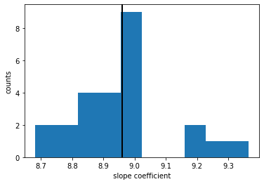
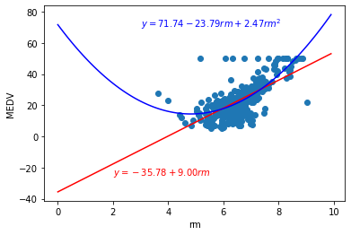
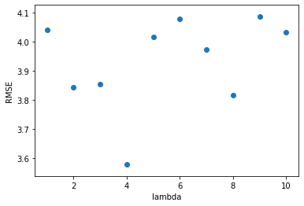

# Problem Set 4, due March 16 at 11:59pm

### Before You Start

This is a fun but challenging problem set. It will test your python skills, as well as your understanding of the material in class and in the readings. Start early and debug often! Some notes:

* Part 1 is meant to be easy, so get through it quickly.
* Part 2 (especially 2.1) will be difficult, but it is the lynchpin of this problem set to make sure to do it well and understand what you've done. If you find your gradient descent algorithm is taking more than a few minutes to complete, debug more, compare notes with others, and go to the TA sessions (especially the sections on vectorized computation and computational efficiency).
* Depending on how well you've done 2.1, parts 2.3 and 4.3 will be relatively painless or incredibly painful. 
* Part 4 (especially 4.3) will be computationally intensive. Don't leave this until the last minute, otherwise your code might be running when the deadline arrives.
* Do the extra credit problems last.

---

## Introduction to the assignment

As with the last assignment, you will be using the [Boston Housing Prices Data Set](https://archive.ics.uci.edu/ml/machine-learning-databases/housing/housing.names).


```python
import IPython
import numpy as np
import scipy as sp
import pandas as pd
import matplotlib
import sklearn

%matplotlib inline  
import matplotlib.pyplot as plt  
import statsmodels.api as sm
from sklearn.linear_model import LinearRegression
from sklearn.metrics import mean_squared_error
import statsmodels.formula.api as smf
from sklearn.utils import shuffle

```


```python
# Load you data the Boston Housing data into a dataframe
# MEDV.txt containt the median house values and data.txt the other 13 features
# in order ["CRIM", "ZN", "INDUS", "CHAS", "NOX","RM","AGE","DIS","RAD","TAX","PTRATIO","B","LSTAT"]
# Your code here
data = np.loadtxt('data.txt')
target = np.loadtxt('MEDV.txt')
```

---

## Part 1: Getting oriented


### 1.1 Use existing libraries

Soon, you will write your own gradient descent algorithm, which you will then use to minimize the squared error cost function.  First, however, let's use the canned versions that come with Python, to make sure we understand what we're aiming to achieve.

Using the same Boston housing prices dataset, use the [Linear Regression class](http://scikit-learn.org/stable/modules/generated/sklearn.linear_model.LinearRegression.html) from sklearn or the [OLS class](http://wiki.scipy.org/Cookbook/OLS) from SciPy to explore the relationship between  median housing price and number of rooms per house. Do this by first (a) regressing the housing price on the number of rooms per house, and then (b) regressing the housing price on the number of rooms per house and the (number of rooms per house) squared.  Interpret your results.


```python
# (a)
X = data[:,5]
X = X.reshape(-1,1)
y = target
reg = LinearRegression().fit(X,y)
print(reg.intercept_,reg.coef_)
```

    -35.576206874519855 [8.95992721]
    


```python
X1 = data[:,5]
X2 = X1**2
X_2 = np.c_[X1,X2]
reg2 = LinearRegression().fit(X_2,y)
print(reg2.intercept_,reg2.coef_)
```

    71.73632810734317 [-23.78960283   2.46914488]
    

*The intercept and the coeffcient corresponding to the number of rooms per house are very different between these two model.*

### 1.2 Training and testing

Chances are, for the above problem you used all of your data to fit the regression line. In some circumstances this is a reasonable thing to do, but often this will result in overfitting. Let's redo the above results the ML way, using careful cross-validation.  Since you are now experts in cross-validation, and have written your own cross-validation algorithm from scratch, you can now take a shortcut and use the libraries that others have built for you.

Using the [cross-validation functions](http://scikit-learn.org/stable/modules/cross_validation.html) from scikit-learn, use 25-fold cross-validation to fit regression (a) above, i.e. the linear fit of housing price on number of rooms per house. Each fold of cross-validation will give you one slope coefficient and one intercept coefficient.  Plot the distribution of the 25 slope coefficients using a histogram, then draw a vertical line at the value of the slope coefficient that you estimated in 1.1 using the full dataset.  What do you notice?


```python
from sklearn.model_selection import KFold
# your code here
slope_dict = []
kf = KFold(n_splits=25)
Xb,yb = shuffle(X,y)
for train, test in kf.split(X):
    regkf = LinearRegression().fit(Xb[train],yb[train])
    slope_dict.append(regkf.coef_[0])
plt.hist(slope_dict)
plt.axvline(reg.coef_[0], color="black", linewidth=2)
plt.xlabel(' slope coefficient ')
plt.ylabel('counts')
```


    Text(0, 0.5, 'counts')





*I notice that given different training dataset, the slope coefficient can be different.*

### 1.3 Regression lines

Create a scatterplot of housing price on rooms per house, and add the two regression lines from 1.1 (or 1.2 if you prefer to do so). Show the linear regression line in red, and the linear+quadratic regression line (which may have curvature) in blue.  Label these two regression lines with the corresponding regression equations (i.e. the slope and intercept of the line).

Bonus: Add the 95% confidence bands (i.e.,  the area that has a 95% chance of containing the true regression line) to each of these lines.

Note: You can get 2 points even without the confidence bands (if the other lines are correct, the axes are labeled, the lines are labeled, the points are plotted correctly, and so forth). If you do everything perfectly including the confidence bands, you get 2 points. If you do something else wrong and would normally receive less than two points, the confidence intervals can replace lost points up to 0.5.

Useful reference: [1](https://www.medcalc.org/manual/scatter_diagram_regression_line.php), [2](https://rpubs.com/aaronsc32/regression-confidence-prediction-intervals)

You can directly use some packages to calculate the bands.


```python
print(reg.intercept_,reg.coef_)
print(reg2.intercept_,reg2.coef_)
```

    -35.576206874519855 [8.95992721]
    71.73632810734317 [-23.78960283   2.46914488]
    


```python
# Your code here
x = np.arange(0, 10, 0.1)
y_line = reg.intercept_ + reg.coef_ * x
y_quad = reg2.intercept_ + reg2.coef_[0] * x + reg2.coef_[1] * x**2
ax = plt.subplot(111)
plt.scatter(X,y)
plt.plot(x,y_line,c = 'r')
plt.plot(x,y_quad,c = 'b')
plt.xlabel('rm')
plt.ylabel('MEDV')
ax.text(2,-25,r"$ y = -35.78 + 9.00rm$", c = 'r')
ax.text(3,70,r"$ y = 71.74 - 23.79rm + 2.47rm^2$", c = 'b')
```


    Text(3, 70, '$ y = 71.74 - 23.79rm + 2.47rm^2$')





## Part 2: Gradient descent: Linear Regression

This is where it gets fun!

### 2.1 Implement gradient descent with one independent variable (average rooms per house)

Implement the batch gradient descent algorithm that we discussed in class. Use the version you implement to regress the housing price on the number of rooms per house. Experiment with 3-4 different values of the learning rate *R*, and do the following:

* Report the values of alpha and beta that minimize the loss function
* Report the number of iterations it takes for your algorithm to converge (for each value of *R*)
* Report the total running time of your algorithm, in seconds
* How do your coefficients compare to the ones estimated through standard libraries? Does this depend on *R*?

Some skeleton code is provided below, but you should feel free to delete this code and start from scratch if you prefer.

* *Hint 1: Don't forget to implement a stopping condition, so that at every iteration you check whether your results have converged. Common approaches to this are to (a) check to see if the loss has stopped decreasing; and (b) check if both your current parameter esimates are close to the estimates from the previous iteration.  In both cases, "close" should not be ==0, it should be <=epsilon, where epsilon is something very small (like 0.0001).*
* *Hint 2: Some people like to include a MaxIterations parameter in their gradient descent algorithm, to prevent divergence. *


```python
import time

"""
Function
--------
bivariate_ols
    Gradient Decent to minimize OLS. Used to find co-efficients of bivariate OLS Linear regression

Parameters
----------
xvalues, yvalues : narray
    xvalues: independent variable
    yvalues: dependent variable
    
R: float
    Learning rate
    
MaxIterations: Int
    maximum number of iterations
    

Returns
-------
alpha: float
    intercept
    
beta: float
    co-efficient
"""
def bivariate_ols(xvalues, yvalues, R=0.01, MaxIterations=1000):
    # initialize the parameters
    start_time = time.time()
    alpha_old = np.random.rand()
    beta_old = np.random.rand()
    alpha_new = np.random.rand()
    beta_new = np.random.rand()
    n = len(xvalues)
    # tolerance and iteration counter
    epsilon = 1e-7
    cnt = 0
    while(np.abs(alpha_old-alpha_new) > epsilon or np.abs(beta_old-beta_new) > epsilon):
        # do GD update steps for as long as the values have not converged,
        # which is equivalent to the gradient values being greater than epsilon
        alpha_old = alpha_new
        beta_old = beta_new
        alpha_new = alpha_old - R / n * ((alpha_old + beta_old * xvalues - yvalues).sum())
        beta_new = beta_old - R / n * (((alpha_old + beta_old * xvalues - yvalues) * xvalues).sum())
        # If it takes too many iterations terminate
        if cnt > MaxIterations:
            print('Iterations exceeded maximum number. Stopping...')
            break
        cnt += 1

    print("Time taken: {:.2f} seconds".format(time.time() - start_time))
    return alpha_new, beta_new, cnt

# example function call
# print(bivariate_ols(X, Y, 0.01, 100000))

```


```python
xvalues = data[:,5]
y = target
```


```python
reg2_1 = LinearRegression().fit(xvalues.reshape(-1, 1),y)
```


```python
print(reg2_1.intercept_,reg2_1.coef_)
```

    -35.576206874519855 [8.95992721]
    


```python
print(bivariate_ols(xvalues, y, 0.1, 100000))
```

    Time taken: 0.03 seconds
    (nan, nan, 581)
    

    C:\Users\Lin\Anaconda3\lib\site-packages\numpy\core\_methods.py:36: RuntimeWarning: overflow encountered in reduce
      return umr_sum(a, axis, dtype, out, keepdims, initial)
    C:\Users\Lin\Anaconda3\lib\site-packages\ipykernel_launcher.py:47: RuntimeWarning: invalid value encountered in double_scalars
    


```python
print(bivariate_ols(xvalues, y, 0.01, 100000))
```

    Time taken: 1.67 seconds
    (-35.57533141767984, 8.959793765784868, 93093)
    


```python
print(bivariate_ols(xvalues, y, 0.001, 1000000))
```

    Time taken: 12.92 seconds
    (-35.567451323522754, 8.9585925979012, 731049)
    

*The intercept and the slope are very close to the lm solution*
*And yes the coefficients depend on R, when R is large, they don't converge.*

### 2.2 Data normalization (done for you!)

Soon, you will implement a version of gradient descent that can use an arbitrary number of independent variables. Before doing this, we want to give you some code in case you want to standardize your features.


```python
def standardize(raw_data):
    return ((raw_data - np.mean(raw_data, axis = 0)) / np.std(raw_data, axis = 0))
```

### 2.3 Implement gradient descent with an arbitrary number of independent variables

Now that you have a simple version of gradient descent working, create a version of gradient descent that can take more than one independent variable.  Assume all independent variables will be continuous.  Test your algorithm using CRIM and RM as independent variables. Standardize these variables before before inputting them to the gradient descent algorithm. 

As before,  report and interpret your estimated coefficients, the number of iterations before convergence, and the total running time of your algorithm. Experiment with 2-3 different values of R.

* *Hint 1: Be careful to implement this efficiently, otherwise it might take a long time for your code to run. Commands like `np.dot` can be a good friend to you on this problem*


```python
"""
Function
--------
multivariate_ols
    Gradient Decent to minimize OLS. Used to find co-efficients of bivariate OLS Linear regression

Parameters
----------
xvalue_matrix, yvalues : narray
    xvalue_matrix: independent variable
    yvalues: dependent variable
    
R: float
    Learning rate
    
MaxIterations: Int
    maximum number of iterations
    

Returns
-------
alpha: float
    intercept
    
beta_array: array[float]
    co-efficient
"""

def multivariate_ols(xvalue_matrix, yvalues, R=0.01, MaxIterations=1000):
    cost_old = np.inf
    cost_new = np.linalg.norm(yvalues)
    start_time = time.time()
    n = len(xvalue_matrix)
    one = np.array([1]*len(xvalue_matrix))
    xvalue_matrix = np.c_[one,xvalue_matrix]
    beta = np.array([np.random.rand()]*xvalue_matrix.shape[1])
    epsilon = 1e-6
    cnt = 0
    while (np.abs(cost_old-cost_new)) > epsilon:
        cost_old = cost_new
        beta = beta - R / n * (xvalue_matrix.T @ xvalue_matrix @ beta - xvalue_matrix.T @ yvalues)
        if cnt > MaxIterations:
            print('Iterations exceeded maximum number. Stopping...')
            break
        cost_new = 1.0 / 2 * (xvalue_matrix @ beta - yvalues).T @ (xvalue_matrix @ beta - yvalues)
        cnt += 1
    alpha = beta[0]
    beta_array = beta[1:]
    print("Time taken: {:.2f} seconds".format(time.time() - start_time))
    return alpha, beta_array, cnt
```


```python
X_nom = standardize(data[:,[0,5]])
y_nom = standardize(y)
```


```python
reg2_3 = LinearRegression().fit(X_nom,y)
print(reg2_3.intercept_,reg2_3.coef_)
```

    22.53280632411067 [-2.24281888  5.8177965 ]
    


```python
multivariate_ols(X_nom, y, R=0.1, MaxIterations=100000)
```

    Time taken: 0.02 seconds
    


    (22.532734474756307, array([-2.24291033,  5.81770377]), 120)


```python
multivariate_ols(X_nom, y, R=0.01, MaxIterations=100000)
```

    Time taken: 0.03 seconds
    


    (22.53244255338574, array([-2.24303811,  5.81756597]), 1095)


```python
multivariate_ols(X_nom, y, R=0.001, MaxIterations=1000000)
```

    Time taken: 0.21 seconds
    


    (22.531593207381132, array([-2.24343701,  5.81712885]), 9803)


*Decreasing R may not necessary get better outcome! Desceasing R will take more time to compute.*

### 2.4 Compare standardized vs. non-standardized results

Repeat the analysis from 2.3, but this time do not standardize your variables - i.e., use the original data. Use the same three values of R (0.1, 0.01, and 0.001). What do you notice about the running time and convergence properties of your algorithm?


```python
# Your code here
reg2_4 = LinearRegression().fit(data[:,[0,5]],y)
print(reg2_4.intercept_,reg2_4.coef_)
```

    -29.977669175879168 [-0.26108248  8.24946836]
    


```python
multivariate_ols(data[:,[0,5]], y, R=0.1, MaxIterations=100000)
```

    Time taken: 0.01 seconds
    

    C:\Users\Lin\Anaconda3\lib\site-packages\ipykernel_launcher.py:45: RuntimeWarning: overflow encountered in matmul
    C:\Users\Lin\Anaconda3\lib\site-packages\ipykernel_launcher.py:39: RuntimeWarning: invalid value encountered in double_scalars
    


    (3.9649464561633296e+152, array([5.89167527e+153, 2.50301369e+153]), 163)


```python
multivariate_ols(data[:,[0,5]], y, R=0.01, MaxIterations=100000)
```

    Time taken: 1.11 seconds
    


    (-29.93625677555037, array([-0.2612195 ,  8.24323088]), 62245)


```python
multivariate_ols(data[:,[0,5]], y, R=0.001, MaxIterations=1000000)
```

    Time taken: 9.18 seconds
    


    (-29.846696662187465, array([-0.26151582,  8.22974143]), 515561)


*When the algorithm run on original data, the running time increases a lot and when R is large, it doesn't converge.*

### **2.5 Implement  Mini-Batch Gradient Descent (MB-GD)**
MB-GD is a Gradient Descent variant that in large data sets can converge faster and is computationally less intensive. Implement MB-GD for question 2.3. Tune the learning rate, number of iterations and "mini-batch" size
so that you compute the estimates within a 1e-2 tolerance. Do not use a batch-size greater than 32.
In summary you go over the entire data set for n epochs. At the beginning of each epoch you shuffle your data once and then you pick k batches (approximately k=#of data points/batch_size). For each batch you compute the gradient, update the parameters and move to the next batch.
MB-GD is similar to Stochastic Gradient Descent but instead of using one sample to compute the gradient we use a batch of samples at each iteration. You can find details about MB-GD here:
https://en.wikipedia.org/wiki/Stochastic_gradient_descent


```python
# Your code here
def multivariate_ols_minibatch(xvalue_matrix, yvalues, R=0.01, MaxIterations=1000, BatchSize = 8):
    start_time = time.time()
    cost_old = np.inf
    cost_new = np.linalg.norm(yvalues)
    start_time = time.time()
    n,p = xvalue_matrix.shape
    alpha_old = np.random.rand()
    beta_old = np.random.rand(p)
    alpha_new = np.random.rand()
    beta_new = np.random.rand(p)
    epsilon = 1e-6
    cnt = 0
    while(np.abs(alpha_old - alpha_new) > epsilon) or (np.max(beta_new - beta_old) > epsilon):
        alpha_old = alpha_new
        beta_old = beta_new
        Xb, yb = shuffle(xvalue_matrix, yvalues)
        for offset in range(0, n, BatchSize):
            end = offset + BatchSize
            batchX, batchy = Xb[offset:end], yb[offset:end]
            alpha_new -= R/BatchSize * (alpha_old + np.dot(batchX, beta_old) - batchy).sum()
            beta_new -= R/BatchSize * np.dot(batchX.T,alpha_old + np.dot(batchX, beta_old) - batchy)
        cnt += 1
        if cnt > MaxIterations:
            print('Iterations exceeded maximum number. Stopping...')
            break
    alpha = alpha_new
    beta_array = beta_new
    print("Time taken: {:.2f} seconds".format(time.time() - start_time))
    return alpha, beta_array, cnt
```


```python
print(reg2_3.intercept_,reg2_3.coef_)
```

    22.53280632411067 [-2.24281888  5.8177965 ]
    


```python
multivariate_ols_minibatch(X_nom, y, R=0.01, MaxIterations=100000, BatchSize = 8)
```

    Time taken: 0.70 seconds
    


    (22.53834147924826, array([-2.23366596,  5.7619315 ]), 815)


```python
multivariate_ols_minibatch(X_nom, y, R=0.01, MaxIterations=100000, BatchSize = 32)
```

    Time taken: 0.05 seconds
    


    (22.534416694675162, array([-2.23721496,  5.81072141]), 122)


Not necessarly speedup in convergence because the dataset is too small.

## 3. Prediction

Let's use our fitted model to make predictions about housing prices. Make sure to first standardize your features before proceeding.

### 3.1 Cross-Validation

Unless you were careful above, you probably overfit your data again. Let's fix that in one of two ways. If you're feeling confident, use k-fold cross-validation to re-fit the multivariate regression from 2.3 above, and report your estimated coefficients (there should be three, corresponding to the intercept and the two coefficients for CRIM and RM). Or if you want to do the quick and dirty version, randomly divide your data into a training set (66%) and testing set (34%) and use the training set to re-fit the regression from 2.3 above. 

*NOTE: * If using k-fold cross-validation, you will end up with a different set of parameters for each fold. In this case, use the parameters from the fold that has the highest test performance.


```python
def compute_RMSE(y_hat,y):
    n = len(y)
    return np.sqrt(((y - y_hat).T @ (y - y_hat))/n)
```


```python
# Your code here
kf3_1 = KFold(n_splits=10)
oldRMSE = np.inf
RMSE_list = []
Xb,yb = shuffle(X_nom,y)
for train, test in kf3_1.split(X_nom):
    alpha, beta_array, cnt = multivariate_ols(X_nom[train], y[train], R=0.01, MaxIterations=100000)
    print(alpha,beta_array)
    y_hat = alpha + X_nom[test] @ beta_array
    RMSE = compute_RMSE(y_hat,y[test])
    print(RMSE)
    RMSE_list.append(RMSE)
    if oldRMSE > RMSE:
        alpha_select, beta_select = alpha, beta_array
        oldRMSE = RMSE
```

    Time taken: 0.04 seconds
    22.691148462806524 [-2.31085023  5.71008467]
    4.416872463693185
    Time taken: 0.05 seconds
    22.53037156071463 [-2.24732567  5.7936034 ]
    2.3258966633519007
    Time taken: 0.05 seconds
    22.77695163105981 [-2.33223065  5.81244419]
    3.971264410514115
    Time taken: 0.04 seconds
    21.98286180318933 [-2.19164771  5.15144749]
    7.811235568110881
    Time taken: 0.03 seconds
    22.3329575469552 [-2.21706783  5.59395098]
    4.130201481740785
    Time taken: 0.03 seconds
    22.111736237330117 [-2.2232239   5.18167317]
    6.189858002838461
    Time taken: 0.04 seconds
    22.64760493180566 [-2.2901513  5.8225927]
    2.453358480073519
    Time taken: 0.05 seconds
    22.231081668671106 [-2.32725558  6.96045065]
    13.83252850133107
    Time taken: 0.04 seconds
    23.093636099174134 [-2.05899845  6.24129706]
    9.435555758879365
    Time taken: 0.03 seconds
    22.735862888634518 [-2.26257379  5.831867  ]
    4.445214949117782
    


```python
alpha_select, beta_select
```


    (22.53037156071463, array([-2.24732567,  5.7936034 ]))


```python
print(reg2_3.intercept_,reg2_3.coef_)
```

    22.53280632411067 [-2.24281888  5.8177965 ]
    


```python
multivariate_ols(X_nom, y, R=0.01, MaxIterations=100000)
```

    Time taken: 0.04 seconds
    


    (22.532498406354275, array([-2.24309925,  5.81750719]), 1114)


*The final outcome of the gradient descent is dependent on something random, like starting coefficients and the dataset. So cross validation may help us get the better coeffcients by testing it in testset.*

### 3.2 Predicted values and RMSE

Let's figure out how accurate this predictive model turned out to be. Compute the RMSE on your test cases, i.e. take the model parameters that you found above, predict the values for just the test instances, and compare the actual to the predicted values. If you did this the k-fold way above, this will be the average RMSE across the k test sets. If you did this the quick and dirty way above, this will just be the RMSE on your single test set.

What is your test RMSE?  How does it compare to the performance of your nearest neighbor algorithm from the last problem set?


```python
# Your code here
np.mean(RMSE_list)
```


    5.9011986279651065


*The test RMSE is 5.9011986279651065, which is smaller than the nearest neighbor algorithm from the last problem set*

### Extra Credit 1: Logistic Regression

For extra credit, implement logistic regression using gradient descent. Create a new variable (EXPENSIVE) to indicate whether the median housing price is more than $40,000. Use your model  a logistic regression of EXPENSIVE on CHAS and RM. Report your results.


```python
# Your code here
expensive = np.array([0]*506)
```


```python
for i in range(len(y)):
    if y[i] > 40:
        expensive[i] = 1
```


```python
X_ec1 = data[:,[3,5]]
X_ec1 = standardize(X_ec1)
```


```python
def logistic_GD(X,y,R = 0.01,MaxIterations=1000):
    cost_old = np.inf
    cost_new = 0
    start_time = time.time()
    n = len(X)
    one = np.array([1]*len(X))
    X = np.c_[one,X]
    beta = np.array([np.random.rand()]*X.shape[1])
    epsilon = 1e-10
    cnt = 0
    while (np.abs(cost_old-cost_new)) > epsilon:
        cost_old = cost_new
        y_hat = 1.0 / (1.0 + np.exp(-X @ beta))
        beta = beta + R / n * (X.T @ (y - y_hat))
        if cnt > MaxIterations:
            print('Iterations exceeded maximum number. Stopping...')
            break
        cost_new = (-1/n) * (y.T @ np.log(y_hat) + (1-y).T @ np.log(1-y_hat))
        cnt += 1
    print(cnt,'times iterations')
    prediction = []
    y_hat = 1.0 / (1.0+np.exp(-X @ beta))
    return y_hat
        
```


```python
y_hat = logistic_GD(X_ec1,expensive,R = 0.01,MaxIterations=1000000)
```

    60502 times iterations
    


```python
def predict(y_hat):
    prediction = []
    for i in range(len(y_hat)):
        if y_hat[i] >= 0.5:
            prediction.append(1)
        else:
            prediction.append(0)
    return prediction
```


```python
prediction = predict(y_hat)
```


```python
np.sum(expensive)
```


    31


```python
dic = {'y': y, 'y_hat': y_hat, 'CHAR':data[:,3],'RM':data[:,5],'expensive':expensive,'prediction':prediction}
```


```python
p = pd.DataFrame(dic)
```


```python
p[p['y_hat']<0.5]
```


<div>
<style scoped>
    .dataframe tbody tr th:only-of-type {
        vertical-align: middle;
    }

    .dataframe tbody tr th {
        vertical-align: top;
    }

    .dataframe thead th {
        text-align: right;
    }
</style>
<table border="1" class="dataframe">
  <thead>
    <tr style="text-align: right;">
      <th></th>
      <th>y</th>
      <th>y_hat</th>
      <th>CHAR</th>
      <th>RM</th>
      <th>expensive</th>
      <th>prediction</th>
    </tr>
  </thead>
  <tbody>
    <tr>
      <td>0</td>
      <td>24.0</td>
      <td>0.031856</td>
      <td>0.0</td>
      <td>6.875396</td>
      <td>0</td>
      <td>0</td>
    </tr>
    <tr>
      <td>1</td>
      <td>21.6</td>
      <td>0.010647</td>
      <td>0.0</td>
      <td>6.499894</td>
      <td>0</td>
      <td>0</td>
    </tr>
    <tr>
      <td>2</td>
      <td>34.7</td>
      <td>0.094573</td>
      <td>0.0</td>
      <td>7.263489</td>
      <td>0</td>
      <td>0</td>
    </tr>
    <tr>
      <td>3</td>
      <td>33.4</td>
      <td>0.081732</td>
      <td>0.0</td>
      <td>7.209732</td>
      <td>0</td>
      <td>0</td>
    </tr>
    <tr>
      <td>4</td>
      <td>36.2</td>
      <td>0.076189</td>
      <td>0.0</td>
      <td>7.184111</td>
      <td>0</td>
      <td>0</td>
    </tr>
    <tr>
      <td>...</td>
      <td>...</td>
      <td>...</td>
      <td>...</td>
      <td>...</td>
      <td>...</td>
      <td>...</td>
    </tr>
    <tr>
      <td>501</td>
      <td>22.4</td>
      <td>0.033743</td>
      <td>0.0</td>
      <td>6.895386</td>
      <td>0</td>
      <td>0</td>
    </tr>
    <tr>
      <td>502</td>
      <td>20.6</td>
      <td>0.006142</td>
      <td>0.0</td>
      <td>6.313574</td>
      <td>0</td>
      <td>0</td>
    </tr>
    <tr>
      <td>503</td>
      <td>23.9</td>
      <td>0.079442</td>
      <td>0.0</td>
      <td>7.199346</td>
      <td>0</td>
      <td>0</td>
    </tr>
    <tr>
      <td>504</td>
      <td>22.0</td>
      <td>0.054695</td>
      <td>0.0</td>
      <td>7.065029</td>
      <td>0</td>
      <td>0</td>
    </tr>
    <tr>
      <td>505</td>
      <td>11.9</td>
      <td>0.006905</td>
      <td>0.0</td>
      <td>6.353149</td>
      <td>0</td>
      <td>0</td>
    </tr>
  </tbody>
</table>
<p>485 rows × 6 columns</p>
</div>


```python
p[(p['y']>40) & (p['y_hat'] >= 0.5)]
```


<div>
<style scoped>
    .dataframe tbody tr th:only-of-type {
        vertical-align: middle;
    }

    .dataframe tbody tr th {
        vertical-align: top;
    }

    .dataframe thead th {
        text-align: right;
    }
</style>
<table border="1" class="dataframe">
  <thead>
    <tr style="text-align: right;">
      <th></th>
      <th>y</th>
      <th>y_hat</th>
      <th>CHAR</th>
      <th>RM</th>
      <th>expensive</th>
      <th>prediction</th>
    </tr>
  </thead>
  <tbody>
    <tr>
      <td>98</td>
      <td>43.8</td>
      <td>0.630978</td>
      <td>0.0</td>
      <td>8.202694</td>
      <td>1</td>
      <td>1</td>
    </tr>
    <tr>
      <td>162</td>
      <td>50.0</td>
      <td>0.755820</td>
      <td>1.0</td>
      <td>7.979213</td>
      <td>1</td>
      <td>1</td>
    </tr>
    <tr>
      <td>163</td>
      <td>50.0</td>
      <td>0.966311</td>
      <td>1.0</td>
      <td>8.727230</td>
      <td>1</td>
      <td>1</td>
    </tr>
    <tr>
      <td>166</td>
      <td>50.0</td>
      <td>0.704832</td>
      <td>0.0</td>
      <td>8.314910</td>
      <td>1</td>
      <td>1</td>
    </tr>
    <tr>
      <td>195</td>
      <td>50.0</td>
      <td>0.654536</td>
      <td>0.0</td>
      <td>8.237173</td>
      <td>1</td>
      <td>1</td>
    </tr>
    <tr>
      <td>204</td>
      <td>50.0</td>
      <td>0.696068</td>
      <td>0.0</td>
      <td>8.300876</td>
      <td>1</td>
      <td>1</td>
    </tr>
    <tr>
      <td>224</td>
      <td>44.8</td>
      <td>0.786016</td>
      <td>0.0</td>
      <td>8.459601</td>
      <td>1</td>
      <td>1</td>
    </tr>
    <tr>
      <td>225</td>
      <td>50.0</td>
      <td>0.914331</td>
      <td>0.0</td>
      <td>8.817964</td>
      <td>1</td>
      <td>1</td>
    </tr>
    <tr>
      <td>232</td>
      <td>41.7</td>
      <td>0.748891</td>
      <td>0.0</td>
      <td>8.389594</td>
      <td>1</td>
      <td>1</td>
    </tr>
    <tr>
      <td>233</td>
      <td>48.3</td>
      <td>0.805302</td>
      <td>0.0</td>
      <td>8.499479</td>
      <td>1</td>
      <td>1</td>
    </tr>
    <tr>
      <td>253</td>
      <td>42.8</td>
      <td>0.753566</td>
      <td>0.0</td>
      <td>8.397999</td>
      <td>1</td>
      <td>1</td>
    </tr>
    <tr>
      <td>257</td>
      <td>50.0</td>
      <td>0.927334</td>
      <td>0.0</td>
      <td>8.878017</td>
      <td>1</td>
      <td>1</td>
    </tr>
    <tr>
      <td>262</td>
      <td>48.8</td>
      <td>0.849878</td>
      <td>0.0</td>
      <td>8.604933</td>
      <td>1</td>
      <td>1</td>
    </tr>
    <tr>
      <td>267</td>
      <td>50.0</td>
      <td>0.859313</td>
      <td>0.0</td>
      <td>8.630451</td>
      <td>1</td>
      <td>1</td>
    </tr>
    <tr>
      <td>282</td>
      <td>46.0</td>
      <td>0.653993</td>
      <td>1.0</td>
      <td>7.813489</td>
      <td>1</td>
      <td>1</td>
    </tr>
    <tr>
      <td>283</td>
      <td>50.0</td>
      <td>0.839063</td>
      <td>1.0</td>
      <td>8.154382</td>
      <td>1</td>
      <td>1</td>
    </tr>
  </tbody>
</table>
</div>


```python
p[(p['y']>40) & (p['y_hat'] >= 0.5)].count()
```


    y             16
    y_hat         16
    CHAR          16
    RM            16
    expensive     16
    prediction    16
    dtype: int64


```python
p[(p['y']<40) & (p['y_hat'] >= 0.5)]
```


<div>
<style scoped>
    .dataframe tbody tr th:only-of-type {
        vertical-align: middle;
    }

    .dataframe tbody tr th {
        vertical-align: top;
    }

    .dataframe thead th {
        text-align: right;
    }
</style>
<table border="1" class="dataframe">
  <thead>
    <tr style="text-align: right;">
      <th></th>
      <th>y</th>
      <th>y_hat</th>
      <th>CHAR</th>
      <th>RM</th>
      <th>expensive</th>
      <th>prediction</th>
    </tr>
  </thead>
  <tbody>
    <tr>
      <td>97</td>
      <td>38.7</td>
      <td>0.762621</td>
      <td>0.0</td>
      <td>8.414590</td>
      <td>0</td>
      <td>1</td>
    </tr>
    <tr>
      <td>226</td>
      <td>37.6</td>
      <td>0.680934</td>
      <td>0.0</td>
      <td>8.277164</td>
      <td>0</td>
      <td>1</td>
    </tr>
    <tr>
      <td>273</td>
      <td>35.2</td>
      <td>0.616099</td>
      <td>1.0</td>
      <td>7.758519</td>
      <td>0</td>
      <td>1</td>
    </tr>
    <tr>
      <td>276</td>
      <td>33.2</td>
      <td>0.521594</td>
      <td>1.0</td>
      <td>7.628632</td>
      <td>0</td>
      <td>1</td>
    </tr>
    <tr>
      <td>364</td>
      <td>21.9</td>
      <td>0.986070</td>
      <td>1.0</td>
      <td>9.030735</td>
      <td>0</td>
      <td>1</td>
    </tr>
  </tbody>
</table>
</div>


```python
p[(p['y']>40) & (p['y_hat'] < 0.5)]
```


<div>
<style scoped>
    .dataframe tbody tr th:only-of-type {
        vertical-align: middle;
    }

    .dataframe tbody tr th {
        vertical-align: top;
    }

    .dataframe thead th {
        text-align: right;
    }
</style>
<table border="1" class="dataframe">
  <thead>
    <tr style="text-align: right;">
      <th></th>
      <th>y</th>
      <th>y_hat</th>
      <th>CHAR</th>
      <th>RM</th>
      <th>expensive</th>
      <th>prediction</th>
    </tr>
  </thead>
  <tbody>
    <tr>
      <td>157</td>
      <td>41.3</td>
      <td>0.088383</td>
      <td>0.0</td>
      <td>7.238456</td>
      <td>1</td>
      <td>0</td>
    </tr>
    <tr>
      <td>161</td>
      <td>50.0</td>
      <td>0.229075</td>
      <td>0.0</td>
      <td>7.614751</td>
      <td>1</td>
      <td>0</td>
    </tr>
    <tr>
      <td>186</td>
      <td>50.0</td>
      <td>0.460049</td>
      <td>0.0</td>
      <td>7.968666</td>
      <td>1</td>
      <td>0</td>
    </tr>
    <tr>
      <td>202</td>
      <td>42.3</td>
      <td>0.459038</td>
      <td>0.0</td>
      <td>7.967298</td>
      <td>1</td>
      <td>0</td>
    </tr>
    <tr>
      <td>203</td>
      <td>48.5</td>
      <td>0.407727</td>
      <td>0.0</td>
      <td>7.897028</td>
      <td>1</td>
      <td>0</td>
    </tr>
    <tr>
      <td>228</td>
      <td>46.7</td>
      <td>0.378156</td>
      <td>0.0</td>
      <td>7.855363</td>
      <td>1</td>
      <td>0</td>
    </tr>
    <tr>
      <td>256</td>
      <td>44.0</td>
      <td>0.165061</td>
      <td>0.0</td>
      <td>7.477839</td>
      <td>1</td>
      <td>0</td>
    </tr>
    <tr>
      <td>261</td>
      <td>43.1</td>
      <td>0.356938</td>
      <td>0.0</td>
      <td>7.824690</td>
      <td>1</td>
      <td>0</td>
    </tr>
    <tr>
      <td>268</td>
      <td>43.5</td>
      <td>0.193209</td>
      <td>0.0</td>
      <td>7.542262</td>
      <td>1</td>
      <td>0</td>
    </tr>
    <tr>
      <td>280</td>
      <td>45.4</td>
      <td>0.380052</td>
      <td>0.0</td>
      <td>7.858069</td>
      <td>1</td>
      <td>0</td>
    </tr>
    <tr>
      <td>368</td>
      <td>50.0</td>
      <td>0.000198</td>
      <td>0.0</td>
      <td>5.157259</td>
      <td>1</td>
      <td>0</td>
    </tr>
    <tr>
      <td>369</td>
      <td>50.0</td>
      <td>0.073744</td>
      <td>1.0</td>
      <td>6.749387</td>
      <td>1</td>
      <td>0</td>
    </tr>
    <tr>
      <td>370</td>
      <td>50.0</td>
      <td>0.259935</td>
      <td>1.0</td>
      <td>7.248060</td>
      <td>1</td>
      <td>0</td>
    </tr>
    <tr>
      <td>371</td>
      <td>50.0</td>
      <td>0.006214</td>
      <td>0.0</td>
      <td>6.317508</td>
      <td>1</td>
      <td>0</td>
    </tr>
    <tr>
      <td>372</td>
      <td>50.0</td>
      <td>0.010055</td>
      <td>1.0</td>
      <td>6.057607</td>
      <td>1</td>
      <td>0</td>
    </tr>
  </tbody>
</table>
</div>


```python
p[(p['y']<40) & (p['y_hat'] < 0.5)]
```


<div>
<style scoped>
    .dataframe tbody tr th:only-of-type {
        vertical-align: middle;
    }

    .dataframe tbody tr th {
        vertical-align: top;
    }

    .dataframe thead th {
        text-align: right;
    }
</style>
<table border="1" class="dataframe">
  <thead>
    <tr style="text-align: right;">
      <th></th>
      <th>y</th>
      <th>y_hat</th>
      <th>CHAR</th>
      <th>RM</th>
      <th>expensive</th>
      <th>prediction</th>
    </tr>
  </thead>
  <tbody>
    <tr>
      <td>0</td>
      <td>24.0</td>
      <td>0.031856</td>
      <td>0.0</td>
      <td>6.875396</td>
      <td>0</td>
      <td>0</td>
    </tr>
    <tr>
      <td>1</td>
      <td>21.6</td>
      <td>0.010647</td>
      <td>0.0</td>
      <td>6.499894</td>
      <td>0</td>
      <td>0</td>
    </tr>
    <tr>
      <td>2</td>
      <td>34.7</td>
      <td>0.094573</td>
      <td>0.0</td>
      <td>7.263489</td>
      <td>0</td>
      <td>0</td>
    </tr>
    <tr>
      <td>3</td>
      <td>33.4</td>
      <td>0.081732</td>
      <td>0.0</td>
      <td>7.209732</td>
      <td>0</td>
      <td>0</td>
    </tr>
    <tr>
      <td>4</td>
      <td>36.2</td>
      <td>0.076189</td>
      <td>0.0</td>
      <td>7.184111</td>
      <td>0</td>
      <td>0</td>
    </tr>
    <tr>
      <td>...</td>
      <td>...</td>
      <td>...</td>
      <td>...</td>
      <td>...</td>
      <td>...</td>
      <td>...</td>
    </tr>
    <tr>
      <td>501</td>
      <td>22.4</td>
      <td>0.033743</td>
      <td>0.0</td>
      <td>6.895386</td>
      <td>0</td>
      <td>0</td>
    </tr>
    <tr>
      <td>502</td>
      <td>20.6</td>
      <td>0.006142</td>
      <td>0.0</td>
      <td>6.313574</td>
      <td>0</td>
      <td>0</td>
    </tr>
    <tr>
      <td>503</td>
      <td>23.9</td>
      <td>0.079442</td>
      <td>0.0</td>
      <td>7.199346</td>
      <td>0</td>
      <td>0</td>
    </tr>
    <tr>
      <td>504</td>
      <td>22.0</td>
      <td>0.054695</td>
      <td>0.0</td>
      <td>7.065029</td>
      <td>0</td>
      <td>0</td>
    </tr>
    <tr>
      <td>505</td>
      <td>11.9</td>
      <td>0.006905</td>
      <td>0.0</td>
      <td>6.353149</td>
      <td>0</td>
      <td>0</td>
    </tr>
  </tbody>
</table>
<p>470 rows × 6 columns</p>
</div>


*The outcome/performance is highly depend on R.*
*(TP = 16,FP = 5,TN = 470,FN = 15), Precision = 0.762, Recall = 0.516, Accuracy = 0.96*

*And at the first time I didn't standardize the data, which made my function not work at all.*

## 4 Regularization 

### 4.1 Get prepped

Step 1: Create new interaction variables between each possible pair of the F_s features. If you originally had *K* features, you should now have K+(K*(K+1))/2 features. Standardize all of your features.

Step 2: For simplicity, generate a single training and testing set.  Randomly sample 66% of your data and call this the training set, and set aside the remaining 34% as your test set.


```python
# Your code here
#step 1
data_copy = data
```


```python
for i in range(data.shape[1]):
    for j in range(i,data.shape[1]):
        data_copy = np.c_[data_copy,data[:,i]*data[:,j]]
```


```python
data_copy.shape[1] # 104 = 13 + 13*14/2
```


    104


```python
#Standardize all of the features.
data_copy = standardize(data_copy)
```


```python
len(data_copy)
```


    506


```python
#step 2
train_idx = np.random.choice(range(len(data)), int(len(data) * .66), replace=False)
test_idx = list(set(range(len(data))) - set(list(train_idx)))
```


```python
train_data = data_copy[train_idx]
test_data = data_copy[test_idx]
train_y = y[train_idx]
test_y = y[test_idx]
```

### 4.2 Overfitting (sort of)
Now, using your version of multivariate regression from 2.3, let's overfit the training data. Using your training set, regress housing price on as many of those K+(K*(K+1))/2 features as you can (Don't forget to add quadratic terms. Form instance, RM^2.).  If you get too greedy, it's possible this will take a long time to compute, so start with 5-10 features, and if you have the time, add more features.

Report the RMSE when you apply your model to your training set and to your testing set. How do these numbers compare to each other, and to the RMSE from 3.2 and nearest neighbors?


```python
# Your code here
#[5,14,27,35,40,41,42,43,44,45], rm^2 [68], age^2 [76]
#[0,3,5,10,11,12,13,26,38,49,59,67,68,69,76,99,100,101,102,103]
X_overfit = train_data[:,range(104)]
```


```python
alpha,beta_array,cnt = multivariate_ols(X_overfit, train_y, R=0.01, MaxIterations=1000000)
```

    Iterations exceeded maximum number. Stopping...
    Time taken: 89.68 seconds
    


```python
print(alpha)
print(beta_array)
```

    22.62972863519189
    [ 2.62308545e-01 -1.25997605e+01 -2.30440068e+01  3.34723621e+00
     -4.88088745e-01  9.32658295e-01  1.95271494e+01 -7.92301217e+00
      1.14524664e+01  5.26136478e+00  4.54636453e+00  1.25818383e+01
      2.33918262e+00  6.73316679e-01  3.16337289e-01  2.27138804e+00
      1.60977884e+00 -2.70671171e+00 -2.96434306e+00  4.99419660e-01
      2.64761733e-01 -6.11858693e+00  8.70795131e+00  1.53438611e+00
     -5.82844833e-01 -2.76902347e+00  5.17623317e-01  2.21213182e-02
     -1.49191593e+00  1.18590710e+00  5.90640118e+00  6.84696694e-02
     -5.22852506e-01 -5.94168694e-01  2.30085874e+00  1.80253135e+00
      1.89708754e+00  3.91792503e-02  8.76168759e+00 -4.14095004e+00
      4.63907907e-01  1.34606909e+01 -6.16205137e-01  1.07199422e+00
      6.99737608e+00  2.06321259e+00 -5.95143488e+00  2.71060485e+00
     -1.59906491e+00  3.34723621e+00 -3.93031737e+00 -1.57230626e+01
      1.91660937e-01  3.80083271e+00 -6.29880303e+00  1.40896976e+01
     -6.48914780e+00  1.28913400e+01 -2.73373805e+00  4.01500352e-01
     -1.81340293e-01  2.01716545e+00  1.77571034e+00  4.31458163e+00
     -9.24473077e+00 -2.51535016e+00  1.56525166e+00  4.76624390e+00
      1.39048743e+01 -1.10605492e+01 -1.91852744e+00 -2.07436456e+00
     -1.22939764e+01 -4.28895691e+00 -5.94021168e+00 -3.81098834e+00
      5.19916553e-01  9.63132026e-01  2.31640984e+00 -3.25022205e+00
      1.58159635e+00 -1.14474922e+01 -6.30871207e+00  6.07009067e+00
     -1.22776008e+00 -2.11520850e+00 -5.67642029e+00  5.98973322e+00
      5.37071111e-01 -2.96661849e+01  2.62302891e+01 -5.47798542e+00
     -1.52184791e+00 -4.21733624e+00 -3.41563036e+00  1.67274942e+01
      3.09021094e-01 -3.62719756e+00 -2.22366795e+00  2.42082330e+00
     -1.62334201e+00 -4.32149909e+00 -1.07838646e+00  6.04958620e+00]
    


```python
y_train_predict = alpha + X_overfit @ beta_array
```


```python
# RMSE of train set
compute_RMSE(y_train_predict,train_y)
```


    2.5598648227547023


```python
X_test = test_data[:,range(104)]
```


```python
y_predict = alpha + X_test @ beta_array
```


```python
# RMSE of test set
compute_RMSE(y_predict,test_y)
```


    5.1607218529457635


*I use all the 104 features to fit the model. The RMSE of training set is 2.5598648227547023 and the RMSE of test set is 5.1607218529457635. As I adding more and more feature from a certain threshold the RMSE of training set get lower and the RMSE of test set get higher. Both of the training set RMSE and the test set RMSE are lower than the nearest neighbor method from ps3. Both the training set RMSE and the test set RMSE are lower than that of 3.2*

### 4.3 Ridge regularization
Incorporate L2 (Ridge) regularization into your multivariate_ols regression. Write a new version of your gradient descent algorithm that includes a regularization term "lambda" to penalize excessive complexity. 

Use your regularized regression to re-fit the model from 4.2 above on your training data. Try this for several different values of lambda, and report your RMSE for each lambda separately for your training and testing data. How do these numbers compare to each other, to the RMSE from 4.2,  to the RMSE from 2.3, and to the RMSE from nearest neighbors?

Go brag to your friends about how you just implemented ridge-regularized multivariate regression using gradient descent optimization, from scratch. If you still have friends.


```python
# Your code here
def multivariate_ols_ridge(xvalue_matrix, yvalues, R=0.01, MaxIterations=1000000, lam = 1):
    cost_old = np.inf
    cost_new = np.linalg.norm(yvalues)
    start_time = time.time()
    n = len(xvalue_matrix)
    one = np.array([1]*len(xvalue_matrix))
    xvalue_matrix = np.c_[one,xvalue_matrix]
    beta = np.array([np.random.rand()]*xvalue_matrix.shape[1])
    epsilon = 1e-6
    cnt = 0
    while (np.abs(cost_old-cost_new)) > epsilon:
        cost_old = cost_new
        beta = beta - R / n * (xvalue_matrix.T @ xvalue_matrix @ beta - xvalue_matrix.T @ yvalues + lam * beta)
        if cnt > MaxIterations:
            print('Iterations exceeded maximum number. Stopping...')
            break
        cost_new = 1.0 / 2 * (xvalue_matrix @ beta - yvalues).T @ (xvalue_matrix @ beta - yvalues) + lam * beta[1:].T @ beta[1:]
        cnt += 1
    alpha = beta[0]
    beta_array = beta[1:]
    print("Time taken: {:.2f} seconds".format(time.time() - start_time))
    return alpha, beta_array, cnt
```


```python
alpha,beta_array,cnt = multivariate_ols_ridge(X_overfit, train_y, R=0.01, MaxIterations=1000000, lam = 4)
```

    Time taken: 7.28 seconds
    


```python
print(alpha)
print(beta_array)
```

    22.233458408135007
    [ 5.13618776e-01 -9.99129479e-01  3.38522770e-01  3.95080423e-01
      7.54002139e-01  2.33075623e+00  1.12772628e+00 -2.18375341e+00
      1.79703552e+00  5.24935795e-01 -5.56265309e-02  1.12737413e+00
      2.47374091e-02 -4.80220716e-03  2.16914726e-01  5.32224888e-01
      1.47616472e+00 -8.43012012e-02 -3.53607322e-01  7.40657264e-01
     -9.56520373e-01  2.85533354e-01  4.66823364e-01  4.18416584e-01
     -1.37340071e+00 -9.26878693e-01 -8.44366958e-03 -4.79588383e-01
     -1.35550686e-01  7.98050979e-01  2.29598171e-01 -5.67665458e-02
     -3.24295688e-01 -4.24287411e-01  1.11454804e+00  9.89382997e-01
     -3.08473717e-01 -6.23976927e-01  2.12809507e+00 -3.66049233e-01
     -3.62476088e-01 -1.49737172e+00 -7.45470671e-02 -3.06390472e-01
      5.01313726e-02  1.33138499e+00 -5.67025775e-01  5.58642951e-01
     -2.24779401e+00  3.95080423e-01 -7.50292439e-01 -3.30236152e+00
      1.03466884e+00  1.38302191e+00 -1.27732160e+00  2.80391437e-03
      4.49568059e-01  2.01160710e+00 -9.98497151e-01 -8.04793701e-01
     -1.11048715e+00  6.63815231e-03  2.18533272e-01  1.19867063e-01
     -9.19298987e-01  9.94977856e-02  7.46040888e-01  7.78348674e-01
      4.66954258e+00 -8.62138756e-01 -3.49799986e-02 -9.82710908e-01
     -2.62449834e+00 -1.41824742e+00  8.80307641e-01 -4.57019767e+00
      3.10711239e-01 -2.81667893e-01  1.51555010e+00  3.72189652e-01
      3.51709625e-01 -1.18220300e+00 -2.22972523e+00  1.74314958e+00
      7.88426198e-01 -1.24017013e+00 -7.18245830e-01 -5.21616573e-01
      1.20479435e+00 -9.73564100e-01  1.12395353e-01  1.23155983e+00
      3.23346066e-01 -2.16333058e+00  3.10285329e-01  1.04131469e+00
     -9.11573564e-02 -1.54847874e+00 -4.58493605e-01  4.61787514e-01
      8.10530162e-01 -1.21008425e+00 -2.94238745e-01  4.45829991e+00]
    


```python
y_train_predict = alpha + X_overfit @ beta_array
```


```python
# RMSE of train set
compute_RMSE(y_train_predict,train_y)
```


    3.2477850776674684


```python
X_test = test_data[:,range(104)]
```


```python
y_predict = alpha + X_test @ beta_array
```


```python
# RMSE of test set
compute_RMSE(y_predict,test_y)
```


    3.7842911560397408


*I choose all the 104 features and find that the RMSE of the test set is 5.1607218529457635 in OLS. The RMSE of the test set of ridge regression (lambda is 4) is 3.7842911560397408.*

### Extra Credit 2: Cross-validate lambda

Use k-fold cross-validation to select the optimal value of lambda. Report the average RMSE across all training sets, and the average RMSE across all testing sets. How do these numbers compare to each other, to the RMSE from your previous efforts?  Finally, create a scatter plot that shows RMSE as a function of lambda.


```python
# Your code here
X = data_copy[:,range(104)]
y = target
lam_list = [1,2,3,4,5,6,7,8,9,10]
RMSE_lam = []
for lam in lam_list:
    kf_ec2 = KFold(n_splits=5)
    rmse_train = []
    rmse_test = []
    for train, test in kf_ec2.split(X):
        Xb, yb = shuffle(X, y)
        alpha, beta_array, cnt = multivariate_ols_ridge(Xb[train], yb[train], R=0.01, MaxIterations=1000000, lam = lam)
        y_hat_train = alpha + Xb[train] @ beta_array
        RMSE_train = compute_RMSE(y_hat_train,yb[train])
        y_hat_test = alpha + Xb[test] @ beta_array
        RMSE_test = compute_RMSE(y_hat_test,yb[test])
        rmse_train.append(RMSE_train)
        rmse_test.append(RMSE_test)
    print('RMSE_train for lambda = ',lam,'is',np.mean(rmse_train))
    print('RMSE_test for lambda = ',lam,'is',np.mean(rmse_test))
    RMSE_lam.append(np.mean(rmse_test))
```

    Time taken: 2.29 seconds
    Time taken: 2.34 seconds
    Time taken: 2.10 seconds
    Time taken: 2.17 seconds
    Time taken: 2.46 seconds
    RMSE_train for lambda =  1 is 2.88939396277299
    RMSE_test for lambda =  1 is 4.04055469399713
    Time taken: 1.11 seconds
    Time taken: 1.13 seconds
    Time taken: 1.06 seconds
    Time taken: 1.21 seconds
    Time taken: 1.29 seconds
    RMSE_train for lambda =  2 is 3.061393232997545
    RMSE_test for lambda =  2 is 3.842511312502244
    Time taken: 14.66 seconds
    Time taken: 1.32 seconds
    Time taken: 1.19 seconds
    Time taken: 18.03 seconds
    Time taken: 21.68 seconds
    RMSE_train for lambda =  3 is 3.0639924705667396
    RMSE_test for lambda =  3 is 3.853230254111206
    Time taken: 23.72 seconds
    Time taken: 22.66 seconds
    Time taken: 15.75 seconds
    Time taken: 0.88 seconds
    Time taken: 0.81 seconds
    RMSE_train for lambda =  4 is 3.173141773320914
    RMSE_test for lambda =  4 is 3.57843605589206
    Time taken: 12.58 seconds
    Time taken: 13.20 seconds
    Time taken: 16.55 seconds
    Time taken: 15.25 seconds
    Time taken: 14.16 seconds
    RMSE_train for lambda =  5 is 3.078019547955603
    RMSE_test for lambda =  5 is 4.016001485868488
    Time taken: 11.46 seconds
    Time taken: 11.81 seconds
    Time taken: 13.11 seconds
    Time taken: 13.16 seconds
    Time taken: 13.85 seconds
    RMSE_train for lambda =  6 is 3.0968014572524853
    RMSE_test for lambda =  6 is 4.0793809626556286
    Time taken: 10.34 seconds
    Time taken: 10.08 seconds
    Time taken: 10.66 seconds
    Time taken: 9.61 seconds
    Time taken: 9.84 seconds
    RMSE_train for lambda =  7 is 3.192457216827594
    RMSE_test for lambda =  7 is 3.9717261999415427
    Time taken: 7.05 seconds
    Time taken: 8.90 seconds
    Time taken: 8.96 seconds
    Time taken: 8.90 seconds
    Time taken: 10.56 seconds
    RMSE_train for lambda =  8 is 3.3098316362440405
    RMSE_test for lambda =  8 is 3.816338118343964
    Time taken: 10.31 seconds
    Time taken: 8.44 seconds
    Time taken: 9.88 seconds
    Time taken: 9.17 seconds
    Time taken: 9.02 seconds
    RMSE_train for lambda =  9 is 3.2571307340110627
    RMSE_test for lambda =  9 is 4.085437154856103
    Time taken: 8.77 seconds
    Time taken: 7.70 seconds
    Time taken: 7.15 seconds
    Time taken: 8.93 seconds
    Time taken: 8.06 seconds
    RMSE_train for lambda =  10 is 3.3228587024119727
    RMSE_test for lambda =  10 is 4.031527267552984
    


```python
RMSE_lam
```


    [4.04055469399713,
     3.842511312502244,
     3.853230254111206,
     3.57843605589206,
     4.016001485868488,
     4.0793809626556286,
     3.9717261999415427,
     3.816338118343964,
     4.085437154856103,
     4.031527267552984]


The RMSE_lam list shows that lambda = 1 is the best one.


```python
dis = {'lambda':lam_list,'RMSE of test set':RMSE_lam}
```


```python
df_ec2 = pd.DataFrame(dis)
```


```python
x = df_ec2['lambda']
y = df_ec2['RMSE of test set']
```


```python
plt.scatter(x,y)
plt.xlabel('lambda')
plt.ylabel('RMSE')
```


    Text(0, 0.5, 'RMSE')





*By k-fold validation(k=3), I found that among lambda = 1,2,...,10, lambda = 4 is the best one.*

###  Extra Credit 3: AdaGrad

AdaGrad is a method to implement gradient descent with different learning rates for each feature. Adaptive algorithms like this one are being extensively used especially in neural network training. Implement AdaGrad on 2.3 but now use CRIM, RM and DIS as independent variables. Standardize these variables before inputting them to the gradient descent algorithm. Tune the algorithm until you estimate the regression coefficients within a tolerance of 1e-1. Use mini-batch gradient descent in this implementation. In summary for each parameter (in our case one intercept and three slopes) the update step of the gradient (in this example $\beta_j$) at iteration $k$ of the GD algorithm becomes:

$$\beta_j=\beta_j -\frac{R}{\sqrt{G^{(k)}_j}}\frac{\partial J(\alpha,\beta_1,\ldots)}{\partial \beta_j}$$ where
$G^{(k)}_j=\sum_{i=1}^{k} (\frac{\partial J^{(i)}(\alpha,\beta_1,\ldots)}{\partial \beta_j})^2$ and $R$ is your learning rate. The notation $\frac{\partial J^{(i)}(\alpha,\beta_1,\ldots)}{\partial \beta_j}$ corresponds to the value of the gradient at iteration $(i)$. Essentially we are "storing" information about previous iteration gradients. Doing that we effectively decrease the learning rate slower when a feature $x_i$ is sparse (i.e. has many zero values which would lead to zero gradients). Although this method is not necessary for our regression problem, it is good to be familiar with these methods as they are widely used in neural network training.  


```python
# Your code here
X_ec3 = data[:,[0,5,7]]
X_ec3 = standardize(X_ec3)
```


```python
y = target
reg_ec3 = LinearRegression().fit(X_ec3,y)
print(reg_ec3.intercept_,reg_ec3.coef_)
```

    22.53280632411067 [-2.12722638  5.77630339  0.32919241]
    


```python
def multivariate_ols_minibatch_ada(xvalue_matrix, yvalues, R=0.01, MaxIterations=1000, BatchSize = 8):
    cost_old = np.inf
    cost_new = np.linalg.norm(yvalues)
    start_time = time.time()
    n = len(xvalue_matrix)
    one = np.array([1]*len(xvalue_matrix))
    xvalue_matrix = np.c_[one,xvalue_matrix]
    beta = np.array([np.random.rand()]*xvalue_matrix.shape[1])
    epsilon = 1e-5
    cnt = 0
    for i in range(MaxIterations):
        # shuffle data
        Xb, yb = shuffle(xvalue_matrix, yvalues)
        # for each of the floor(n/K) batches do gradient steps
        cost_old = cost_new
        ada = 0
        for offset in range(0, n, BatchSize):
            end = offset + BatchSize
            batchx, batchy = Xb[offset:end], yb[offset:end]
            G = (batchx.T @ batchx @ beta - batchx.T @ batchy)/n
            ada = ada + G.T @ G
            beta = beta - R /np.sqrt(ada) * G
        cost_new = 1.0 / 2 * (batchx @ beta - batchy).T @ (batchx @ beta - batchy)
        if (np.abs(cost_old-cost_new)) <= epsilon:
            break
        if cnt > MaxIterations:
            print('Iterations exceeded maximum number. Stopping...')
            break
        cnt += 1
        R = R/cnt
    alpha = beta[0]
    beta_array = beta[1:]
    print("Time taken: {:.2f} seconds".format(time.time() - start_time))
    return alpha, beta_array, cnt
```


```python
multivariate_ols_minibatch_ada(X_ec3, y, R=20, MaxIterations=100000, BatchSize = 32)
```

    Time taken: 33.10 seconds
    


    (22.544485881359094, array([-2.1327432 ,  5.8653095 ,  0.33987889]), 100000)


*When R = 20, iterations = 100000, BatchSize = 32. The outcome is coefficients within a tolerance of 1e-1 compared to the LinearRegression one*


```python

```
