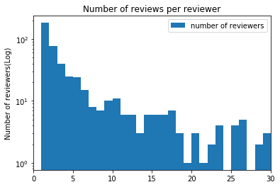
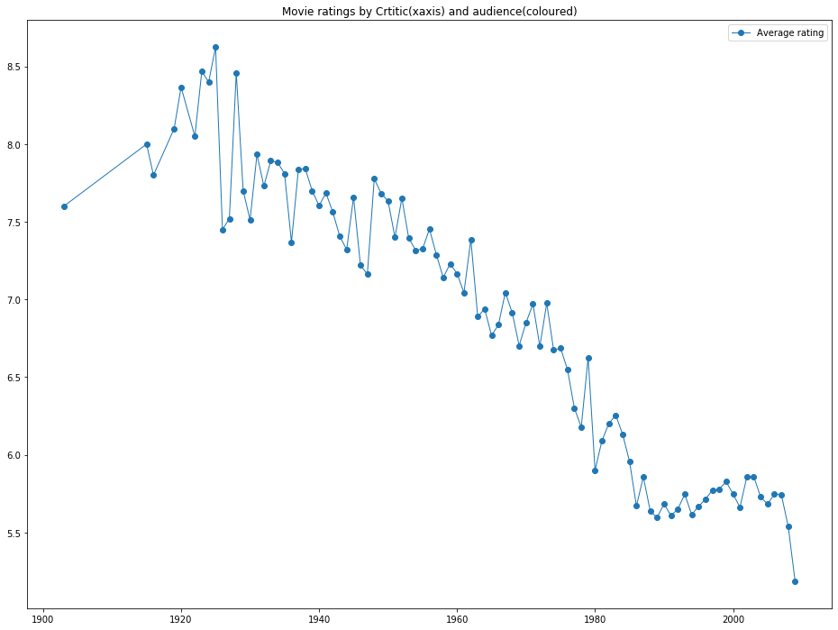

# Problem Set 5

As usual, you are highly encouraged to *start this problem set early!*  My best guess (no guarantees!) is that Part 1 will be conceptually easy but perhaps time consuming.  Parts 2 and 3 are medium difficult, but there are plenty of opportunities to get confused with python data structures, so if you're going to get stuck, get stuck (and unstuck) early!

Note that the two extra credit problems have the potential to be quite challenging and time consuming. Make sure to do everything else in the problem set before you tackle the extra credit.

To get started, download the files "reviews.csv" and "movies.dat" from Canvas.

For this assignment, the following libraries may be useful:

* [numpy](http://docs.scipy.org/doc/numpy-dev/user/index.html), for arrays
* [scikit-learn](http://scikit-learn.org/stable/), for machine learning
* [pandas](http://pandas.pydata.org/), for data frames
* [matplotlib](http://matplotlib.org/), for plotting

In particular, I suggest you familiarize yourself with the following aspects of these libraries, which are not required but which might make your life easier:

* `DataFrame` and other basic [data structures](http://pandas.pydata.org/pandas-docs/stable/dsintro.html) in pandas
* [`groupby`](http://pandas.pydata.org/pandas-docs/stable/groupby.html), `unique`,  and other simple aggregation functions
* [`CountVectorizer`](http://scikit-learn.org/stable/modules/generated/sklearn.feature_extraction.text.CountVectorizer.html) for working with text in sklearn.
* [`MultinomialNB`](http://scikit-learn.org/stable/modules/generated/sklearn.naive_bayes.MultinomialNB.html) for Naive Bayes
* Simple tools for [Cross-Validation](http://scikit-learn.org/stable/modules/cross_validation.html) in sklearn

Make sure they load properly with the following code block:


```python
%matplotlib inline
import pandas as pd
import numpy as np
import matplotlib.pyplot as plt
import time

#hint: Consult the scikit-learn documentation to
#      learn about what these classes do do
from  sklearn.model_selection import cross_val_score
from sklearn.model_selection import train_test_split
from sklearn.naive_bayes import MultinomialNB
from sklearn.feature_extraction.text import CountVectorizer
import statsmodels.formula.api as smf
from sklearn.metrics import mean_squared_error
from sklearn.preprocessing import StandardScaler
from sklearn.decomposition import PCA
```

## Introduction to the assignment

In this assignment, you'll be analyzing movie reviews in an attempt to determine whether movies are good or bad.  I've downloaded a large number of movie reviews from the [Rotten Tomatoes](http://www.rottentomatoes.com) website, which are available in the file "reviews.csv" on Canvas.  I've also put a file "movies.dat" on Canvas that contains metadata for ~65,000 different movies

If you've never seen Rotten Tomatoes before, go spend a few minutes familiarizing yourself with the website.  It's a meta-review website that aggregates movie reviews from a large number of critics.  Here's what the page for this year's [Oscar winner](https://www.rottentomatoes.com/m/the_shape_of_water_2017) looks like.  Note in particular the section on "Critic Reviews" at the bottom -- that's the content that has been scraped and put in the reviews.csv file.  Also note that each movie is given a quantitative score on the Tomatometer which is used to classify the movie as either Fresh (good) or Rotten (bad).

Your mission is to develop a classifier to determine whether a movie is Fresh or Rotten based on the contents of the reviews given to the movie.  As usual, we'll start out with some exploratory data analysis.

---

## Part 1: Descriptive analysis

Before beginning the "real" work, dig into the data a bit do see what you're dealing with.  Begin by loading the datasets and dropping rows that have missing data:


```python
reviews = pd.read_csv('reviews.csv')
movies = pd.read_csv("movies.dat", delimiter='\t')

reviews = reviews[~reviews.quote.isnull()]
reviews = reviews[reviews.fresh != 'none']
reviews = reviews[reviews.quote.str.len() > 0]
```

### 1.1: Basic features of the dataset

Answer the following questions by having your python code directly print the answers:

* How many unique reviews (quotes) are in the `reviews` dataset?
* How many unique reviewers (critics) are in the `reviews` dataset?
* How many unique movies are in the `reviews` dataset?
* How many unique movies are in the *`movies`* dataset?
* How many different publications have reviews in the `reviews` dataset?


```python
reviews['fresh'] = reviews['fresh'].map({'fresh':1, 'rotten':0})
```


```python
reviews.head(5)
```


<div>
<style scoped>
    .dataframe tbody tr th:only-of-type {
        vertical-align: middle;
    }

    .dataframe tbody tr th {
        vertical-align: top;
    }

    .dataframe thead th {
        text-align: right;
    }
</style>
<table border="1" class="dataframe">
  <thead>
    <tr style="text-align: right;">
      <th></th>
      <th>critic</th>
      <th>fresh</th>
      <th>imdb</th>
      <th>link</th>
      <th>publication</th>
      <th>quote</th>
      <th>review_date</th>
      <th>rtid</th>
      <th>title</th>
    </tr>
  </thead>
  <tbody>
    <tr>
      <td>0</td>
      <td>Derek Adams</td>
      <td>1</td>
      <td>114709</td>
      <td>http://www.timeout.com/film/reviews/87745/toy-...</td>
      <td>Time Out</td>
      <td>So ingenious in concept, design and execution ...</td>
      <td>2009-10-04 00:00:00</td>
      <td>9559</td>
      <td>Toy Story</td>
    </tr>
    <tr>
      <td>1</td>
      <td>Richard Corliss</td>
      <td>1</td>
      <td>114709</td>
      <td>http://www.time.com/time/magazine/article/0,91...</td>
      <td>TIME Magazine</td>
      <td>The year's most inventive comedy.</td>
      <td>2008-08-31 00:00:00</td>
      <td>9559</td>
      <td>Toy Story</td>
    </tr>
    <tr>
      <td>2</td>
      <td>David Ansen</td>
      <td>1</td>
      <td>114709</td>
      <td>http://www.newsweek.com/id/104199</td>
      <td>Newsweek</td>
      <td>A winning animated feature that has something ...</td>
      <td>2008-08-18 00:00:00</td>
      <td>9559</td>
      <td>Toy Story</td>
    </tr>
    <tr>
      <td>3</td>
      <td>Leonard Klady</td>
      <td>1</td>
      <td>114709</td>
      <td>http://www.variety.com/review/VE1117941294.htm...</td>
      <td>Variety</td>
      <td>The film sports a provocative and appealing st...</td>
      <td>2008-06-09 00:00:00</td>
      <td>9559</td>
      <td>Toy Story</td>
    </tr>
    <tr>
      <td>4</td>
      <td>Jonathan Rosenbaum</td>
      <td>1</td>
      <td>114709</td>
      <td>http://onfilm.chicagoreader.com/movies/capsule...</td>
      <td>Chicago Reader</td>
      <td>An entertaining computer-generated, hyperreali...</td>
      <td>2008-03-10 00:00:00</td>
      <td>9559</td>
      <td>Toy Story</td>
    </tr>
  </tbody>
</table>
</div>


```python
print('There are',len(reviews.quote.unique()), 'unique reviews in the reviews dataset')
print('There are',len(reviews.critic.unique()),'unique critics in the reviews dataset')
print('There are',len(reviews.title.unique()),'unique movies in the reviews dataset')
print('There are',len(movies.title.unique()),'unique movies in the movies dataset')
print('There are',len(reviews.publication.unique()),'different publications have reviews in the reviews dataset')
```

    There are 12814 unique reviews in the reviews dataset
    There are 541 unique critics in the reviews dataset
    There are 1720 unique movies in the reviews dataset
    There are 9405 unique movies in the movies dataset
    There are 64 different publications have reviews in the reviews dataset
    

### 1.2 Number of reviews per reviewer

Using the `reviews` dataset, create a histogram showing the distribution of the number of reviews per reviewer.  Create the bin width (x-axis) to be 1 unit wide, and the range of the axis to be from 0 to 30.  Scale the y-axis to show the logarithm of (count of) the number of reviewers.  Label your axes and make your histogram look professional.


```python
# enter your code here
critics_df = pd.DataFrame(reviews.groupby('critic').count())
critics_df.reset_index(level=0, inplace=True)
```


```python
plt.hist(critics_df.quote, range=[0,30], bins= 30,label ="number of reviewers")
plt.xlim([0, 30])
plt.ylabel('Number of reviewers(Log)')
plt.yscale('log', nonposy='clip')
plt.title('Number of reviews per reviewer')
plt.legend(loc="best")
```


    <matplotlib.legend.Legend at 0x1c7e0531348>





### 1.3 Zoom in on a few reviewers
Find the 30 critics with the most reviews, and list their names in a table along with (a) the name of the publication they work for, (b) the date of their first review, and (c) the date of their last review

*hint: use the groupby function to do this quickly*


```python
most_reviews = pd.DataFrame(reviews.groupby('critic')['quote'].count().nlargest(30))
most_reviews.reset_index(level=0, inplace=True)
```


```python
most_reviews.columns = ['critic', 'quote count']
```


```python
publication = pd.DataFrame(reviews.groupby('critic')['publication'].apply(np.unique))
```


```python
publication.reset_index(level=0, inplace=True)
```


```python
min_df = pd.DataFrame(reviews.groupby('critic').review_date.min())
max_df = pd.DataFrame(reviews.groupby('critic').review_date.max())
min_df.columns = ['start_date']
max_df.columns = ['end_date']
min_df.reset_index(level=0, inplace=True)
max_df.reset_index(level=0, inplace=True)
```


```python
data_df = pd.merge(most_reviews,publication, on = 'critic')
data_df = pd.merge(data_df,min_df,on = 'critic')
data_df = pd.merge(data_df,max_df,on = 'critic')
```


```python
data_df
```


<div>
<style scoped>
    .dataframe tbody tr th:only-of-type {
        vertical-align: middle;
    }

    .dataframe tbody tr th {
        vertical-align: top;
    }

    .dataframe thead th {
        text-align: right;
    }
</style>
<table border="1" class="dataframe">
  <thead>
    <tr style="text-align: right;">
      <th></th>
      <th>critic</th>
      <th>quote count</th>
      <th>publication</th>
      <th>start_date</th>
      <th>end_date</th>
    </tr>
  </thead>
  <tbody>
    <tr>
      <td>0</td>
      <td>Roger Ebert</td>
      <td>1150</td>
      <td>[At the Movies, Chicago Sun-Times]</td>
      <td>2000-01-01 00:00:00</td>
      <td>2013-06-11 00:00:00</td>
    </tr>
    <tr>
      <td>1</td>
      <td>James Berardinelli</td>
      <td>833</td>
      <td>[ReelViews]</td>
      <td>1800-01-01 00:00:00</td>
      <td>2012-02-07 00:00:00</td>
    </tr>
    <tr>
      <td>2</td>
      <td>Janet Maslin</td>
      <td>526</td>
      <td>[New York Times]</td>
      <td>2000-01-01 00:00:00</td>
      <td>2010-09-07 00:00:00</td>
    </tr>
    <tr>
      <td>3</td>
      <td>Variety Staff</td>
      <td>449</td>
      <td>[Variety]</td>
      <td>2001-02-13 00:00:00</td>
      <td>2012-08-15 00:00:00</td>
    </tr>
    <tr>
      <td>4</td>
      <td>Jonathan Rosenbaum</td>
      <td>420</td>
      <td>[Chicago Reader]</td>
      <td>1988-07-11 00:00:00</td>
      <td>2013-10-22 00:00:00</td>
    </tr>
    <tr>
      <td>5</td>
      <td>Desson Thomson</td>
      <td>373</td>
      <td>[Washington Post]</td>
      <td>2000-01-01 00:00:00</td>
      <td>2012-10-08 00:00:00</td>
    </tr>
    <tr>
      <td>6</td>
      <td>Geoff Andrew</td>
      <td>361</td>
      <td>[Time Out]</td>
      <td>2005-08-11 00:00:00</td>
      <td>2012-04-05 00:00:00</td>
    </tr>
    <tr>
      <td>7</td>
      <td>Dave Kehr</td>
      <td>360</td>
      <td>[Chicago Reader, Chicago Tribune, New York Dai...</td>
      <td>2000-01-01 00:00:00</td>
      <td>2013-11-20 00:00:00</td>
    </tr>
    <tr>
      <td>8</td>
      <td>Kenneth Turan</td>
      <td>282</td>
      <td>[Los Angeles Times]</td>
      <td>2000-01-01 00:00:00</td>
      <td>2013-10-05 00:00:00</td>
    </tr>
    <tr>
      <td>9</td>
      <td>Mick LaSalle</td>
      <td>280</td>
      <td>[San Francisco Chronicle]</td>
      <td>2000-01-01 00:00:00</td>
      <td>2009-11-25 00:00:00</td>
    </tr>
    <tr>
      <td>10</td>
      <td>Owen Gleiberman</td>
      <td>241</td>
      <td>[Entertainment Weekly]</td>
      <td>1800-01-01 00:00:00</td>
      <td>2011-09-07 00:00:00</td>
    </tr>
    <tr>
      <td>11</td>
      <td>Rita Kempley</td>
      <td>236</td>
      <td>[Washington Post]</td>
      <td>2000-01-01 00:00:00</td>
      <td>2013-11-02 00:00:00</td>
    </tr>
    <tr>
      <td>12</td>
      <td>Joe Baltake</td>
      <td>231</td>
      <td>[Passionate Moviegoer, Philadelphia Daily News...</td>
      <td>2000-01-01 00:00:00</td>
      <td>2013-08-04 00:00:00</td>
    </tr>
    <tr>
      <td>13</td>
      <td>Todd McCarthy</td>
      <td>223</td>
      <td>[Variety]</td>
      <td>2000-01-01 00:00:00</td>
      <td>2012-10-09 00:00:00</td>
    </tr>
    <tr>
      <td>14</td>
      <td>Vincent Canby</td>
      <td>207</td>
      <td>[New York Times]</td>
      <td>2000-01-01 00:00:00</td>
      <td>2013-07-29 00:00:00</td>
    </tr>
    <tr>
      <td>15</td>
      <td>Hal Hinson</td>
      <td>174</td>
      <td>[Washington Post]</td>
      <td>2000-01-01 00:00:00</td>
      <td>2013-06-26 00:00:00</td>
    </tr>
    <tr>
      <td>16</td>
      <td>Susan Stark</td>
      <td>167</td>
      <td>[Detroit News]</td>
      <td>2000-01-01 00:00:00</td>
      <td>2002-10-25 00:00:00</td>
    </tr>
    <tr>
      <td>17</td>
      <td>Stephen Holden</td>
      <td>166</td>
      <td>[New York Times]</td>
      <td>2000-01-01 00:00:00</td>
      <td>2009-02-06 00:00:00</td>
    </tr>
    <tr>
      <td>18</td>
      <td>Derek Adams</td>
      <td>154</td>
      <td>[Time Out]</td>
      <td>2006-01-26 00:00:00</td>
      <td>2009-10-04 00:00:00</td>
    </tr>
    <tr>
      <td>19</td>
      <td>Kevin Thomas</td>
      <td>145</td>
      <td>[Los Angeles Times]</td>
      <td>2000-01-01 00:00:00</td>
      <td>2013-11-02 00:00:00</td>
    </tr>
    <tr>
      <td>20</td>
      <td>Peter Stack</td>
      <td>138</td>
      <td>[San Francisco Chronicle]</td>
      <td>2000-01-01 00:00:00</td>
      <td>2002-06-18 00:00:00</td>
    </tr>
    <tr>
      <td>21</td>
      <td>Bosley Crowther</td>
      <td>137</td>
      <td>[New York Times]</td>
      <td>2000-01-01 00:00:00</td>
      <td>2008-05-06 00:00:00</td>
    </tr>
    <tr>
      <td>22</td>
      <td>Rick Groen</td>
      <td>129</td>
      <td>[Globe and Mail]</td>
      <td>2002-03-19 00:00:00</td>
      <td>2009-08-14 00:00:00</td>
    </tr>
    <tr>
      <td>23</td>
      <td>Edward Guthmann</td>
      <td>121</td>
      <td>[San Francisco Chronicle]</td>
      <td>2000-01-01 00:00:00</td>
      <td>2003-04-04 00:00:00</td>
    </tr>
    <tr>
      <td>24</td>
      <td>Lisa Schwarzbaum</td>
      <td>117</td>
      <td>[Entertainment Weekly]</td>
      <td>1979-01-01 00:00:00</td>
      <td>2012-08-15 00:00:00</td>
    </tr>
    <tr>
      <td>25</td>
      <td>Liam Lacey</td>
      <td>111</td>
      <td>[Globe and Mail]</td>
      <td>2001-08-24 00:00:00</td>
      <td>2012-04-04 00:00:00</td>
    </tr>
    <tr>
      <td>26</td>
      <td>Emanuel Levy</td>
      <td>110</td>
      <td>[Variety]</td>
      <td>2000-01-01 00:00:00</td>
      <td>2010-08-06 00:00:00</td>
    </tr>
    <tr>
      <td>27</td>
      <td>Richard Schickel</td>
      <td>106</td>
      <td>[TIME Magazine, The Atlantic]</td>
      <td>2000-01-01 00:00:00</td>
      <td>2013-08-05 00:00:00</td>
    </tr>
    <tr>
      <td>28</td>
      <td>Richard Corliss</td>
      <td>104</td>
      <td>[TIME Magazine]</td>
      <td>2003-12-16 00:00:00</td>
      <td>2013-11-06 00:00:00</td>
    </tr>
    <tr>
      <td>29</td>
      <td>Michael Wilmington</td>
      <td>103</td>
      <td>[Chicago Tribune, Los Angeles Times]</td>
      <td>2000-01-01 00:00:00</td>
      <td>2013-11-21 00:00:00</td>
    </tr>
  </tbody>
</table>
</div>


### 1.4 Ratings over time

Using the `movies` dataset, create a plot that shows how the average rating per movie (rtAllCriticsRating) has evolved over time.  Do this by creating a scatterplot where the x-axis is the year in which the movie was released and the y-axis is rtAllCriticsRating.  Drop movies with 0 or unknown values to avoid biasing your results.  Then, create a scatterplot that has one <year,rating> point for each remaining movie, and pick an appropriate size/color/transparency for these points to ensure that the graph looks professional.  In other words, do not simply use the default settings, as this will produce a dense mess of dots that will be hard to interpret.  Finally, overlay on this scatterplot a line graph in orange showing how the average movie rating (the average of rtAllCriticsRating across all movies in a year) has changed over time.  Do you notice a trend?  What do you think it means?


```python
# enter your code here
movies_copy = movies
movies_copy['rtAllCriticsRating'] = pd.to_numeric(movies_copy['rtAllCriticsRating'], errors = 'coerce')
```


```python
movies_copy.dtypes
```


    id                          int64
    title                      object
    imdbID                      int64
    spanishTitle               object
    imdbPictureURL             object
    year                        int64
    rtID                       object
    rtAllCriticsRating        float64
    rtAllCriticsNumReviews     object
    rtAllCriticsNumFresh       object
    rtAllCriticsNumRotten      object
    rtAllCriticsScore          object
    rtTopCriticsRating         object
    rtTopCriticsNumReviews     object
    rtTopCriticsNumFresh       object
    rtTopCriticsNumRotten      object
    rtTopCriticsScore          object
    rtAudienceRating           object
    rtAudienceNumRatings       object
    rtAudienceScore            object
    rtPictureURL               object
    dtype: object


```python
movies_copy['rtAllCriticsRating'] = movies_copy['rtAllCriticsRating'].apply(lambda x: x if x >0 else None)
```


```python
movies_copy = movies_copy[movies_copy['rtAllCriticsRating'] > 0]
```


```python
year_df = pd.DataFrame(movies_copy.groupby('year')['year'].count())
year_df.columns = ['count']
year_df['sumRating'] = movies_copy.groupby('year')['rtAllCriticsRating'].sum()

year_df['avgRating'] = year_df['sumRating']/year_df['count']
year_df.reset_index(level=0, inplace =True)

year_df = year_df.dropna()
# Uncomment to plot a trend in average rating over the year
plt.figure(figsize=(16,12))
plt.plot(year_df['year'], year_df['avgRating'],linewidth=1.0,marker='o', label='Average rating')
plt.legend()
plt.title('Movie ratings by Crtitic(xaxis) and audience(coloured)')
```


    Text(0.5, 1.0, 'Movie ratings by Crtitic(xaxis) and audience(coloured)')





*The average rating of movies has been getting lower in recent years. This may be that the audience is more and more critical of the movie, it may be that the average level of the movie is getting lower, or it may be caused by other reasons.*


```python
year_df
```


<div>
<style scoped>
    .dataframe tbody tr th:only-of-type {
        vertical-align: middle;
    }

    .dataframe tbody tr th {
        vertical-align: top;
    }

    .dataframe thead th {
        text-align: right;
    }
</style>
<table border="1" class="dataframe">
  <thead>
    <tr style="text-align: right;">
      <th></th>
      <th>year</th>
      <th>count</th>
      <th>sumRating</th>
      <th>avgRating</th>
    </tr>
  </thead>
  <tbody>
    <tr>
      <td>0</td>
      <td>1903</td>
      <td>1</td>
      <td>7.6</td>
      <td>7.600000</td>
    </tr>
    <tr>
      <td>1</td>
      <td>1915</td>
      <td>1</td>
      <td>8.0</td>
      <td>8.000000</td>
    </tr>
    <tr>
      <td>2</td>
      <td>1916</td>
      <td>1</td>
      <td>7.8</td>
      <td>7.800000</td>
    </tr>
    <tr>
      <td>3</td>
      <td>1919</td>
      <td>1</td>
      <td>8.1</td>
      <td>8.100000</td>
    </tr>
    <tr>
      <td>4</td>
      <td>1920</td>
      <td>3</td>
      <td>25.1</td>
      <td>8.366667</td>
    </tr>
    <tr>
      <td>...</td>
      <td>...</td>
      <td>...</td>
      <td>...</td>
      <td>...</td>
    </tr>
    <tr>
      <td>88</td>
      <td>2005</td>
      <td>293</td>
      <td>1665.1</td>
      <td>5.682935</td>
    </tr>
    <tr>
      <td>89</td>
      <td>2006</td>
      <td>312</td>
      <td>1793.3</td>
      <td>5.747756</td>
    </tr>
    <tr>
      <td>90</td>
      <td>2007</td>
      <td>310</td>
      <td>1780.7</td>
      <td>5.744194</td>
    </tr>
    <tr>
      <td>91</td>
      <td>2008</td>
      <td>221</td>
      <td>1224.1</td>
      <td>5.538914</td>
    </tr>
    <tr>
      <td>92</td>
      <td>2009</td>
      <td>20</td>
      <td>103.7</td>
      <td>5.185000</td>
    </tr>
  </tbody>
</table>
<p>93 rows × 4 columns</p>
</div>


---

## Part 2: Naive Bayes

Now it gets fun!  You are going to use a [Naive Bayes classifier](https://en.wikipedia.org/wiki/Naive_Bayes_classifier) to build a prediction model for whether a review is fresh or rotten, depending on the text of the review. Review the assigned readings on Canvas, as well as the relevant lecture notes before embarking on this journey.

### Using CountVectorizer

One thing that may help you in the following problems is the [CountVectorizer](http://scikit-learn.org/stable/modules/generated/sklearn.feature_extraction.text.CountVectorizer.html) object in Scikit-learn.  This will help you convert your raw text fields into "bag of words" vectors, i.e. a data structure that tells you how many times a particular word appears in a blurb.  Here's a simple example, make sure you understand what's going on!


```python
from sklearn.feature_extraction.text import CountVectorizer

text = ['machine learning rocks', 'machine learning rules', 'rocks rocks rules']
print("Original text is\n", '\n'.join(text))
print()
vectorizer = CountVectorizer(min_df=0)

# call `fit` to build the vocabulary
vectorizer.fit(text)

# call `transform` to convert text to a bag of words
x = vectorizer.transform(text)
print(x)
# CountVectorizer uses a sparse array to save memory, but it's easier in this assignment to 
# convert back to a "normal" numpy array
x = x.toarray()

print("Transformed text vector is \n", x)
print()
# `get_feature_names` tracks which word is associated with each column of the transformed x
print("Words for each feature:")
print(vectorizer.get_feature_names())
```

    Original text is
     machine learning rocks
    machine learning rules
    rocks rocks rules
    
      (0, 0)	1
      (0, 1)	1
      (0, 2)	1
      (1, 0)	1
      (1, 1)	1
      (1, 3)	1
      (2, 2)	2
      (2, 3)	1
    Transformed text vector is 
     [[1 1 1 0]
     [1 1 0 1]
     [0 0 2 1]]
    
    Words for each feature:
    ['learning', 'machine', 'rocks', 'rules']
    

### 2.1 Create your X input and Y output

Using the `reviews` dataframe, compute a pair of numerical X, Y arrays where:
    
 * X is a `(nreview, nwords)` array. Each row corresponds to a bag-of-words representation for a single review. This will be the *input* to your model.
 * Y is a `nreview`-element 1/0 array, encoding whether a review is Fresh (1) or Rotten (0). This is the desired *output* from your model.
 
Make sure to remove items with no review text


```python
"""
Function
--------
make_xy

Build a bag-of-words training set for the review data

Parameters
-----------
reviews : Pandas DataFrame
    The review data from above
    
vectorizer : CountVectorizer object (optional)
    A CountVectorizer object to use. If None,
    then create and fit a new CountVectorizer.
    Otherwise, re-fit the provided CountVectorizer
    using the reviews data
    
Returns
-------
X : numpy array (dims: nreview, nwords)
    Bag-of-words representation for each review.
Y : numpy array (dims: nreview)
    1/0 array. 1 = fresh review, 0 = rotten review

Examples
--------
X, Y = make_xy(reviews)
"""
def make_xy(reviews, vectorizer=None):
    #Your code here    
    if(vectorizer==None):
        vectorizer = CountVectorizer()
    
    review_list = list(reviews.quote)
    vectorizer.fit(review_list)
    X = vectorizer.transform(review_list)
    Y = reviews['fresh']
    Y = np.array(Y)
    X = X.toarray()
    return X, Y

```


```python
X, Y = make_xy(reviews)
```

### 2.2 Test-Train split

Next, randomly split the data into two groups: a training set (80%) and a validation set (20%).  You can do this manually, as you did in the prior problem set.  Or, use [`train_test_split`](http://scikit-learn.org/stable/modules/generated/sklearn.cross_validation.train_test_split.html) to do this auto-magically.  See [this guide](http://scikit-learn.org/stable/modules/cross_validation.html) for a simple example of how `train_test_split` works.


```python
# enter your code here
from sklearn.model_selection import train_test_split

X_train,X_test, Y_train,Y_test = train_test_split(X, Y, test_size=0.20)
```


```python
print(X_train.shape)
print(X_test.shape)
```

    (10735, 20875)
    (2684, 20875)
    

### 2.3 Naive Bayes with `MultinomialNB`
Use the training set to train a Naive Bayes classifier using the [`MultinomialNB`](http://scikit-learn.org/stable/modules/generated/sklearn.naive_bayes.MultinomialNB.html)
 object.  Report the accuracy of this model on both the training and testing data.  What do you observe?  Interpret these results!

*Hint: This shouldn't take more than 5-10 lines of code to accomplish*


```python
# enter your code here
from sklearn.naive_bayes import MultinomialNB
nv_model = MultinomialNB()
nv_model.fit(X_train, Y_train)

# call the fitted model fitted_model, for future reference:
fitted_model = nv_model
start_time = time.time()
# Accuracy on the training model.
print("Accuracy on the Training set: ", nv_model.score(X_train, Y_train))

# Accuracy on the training model.
print("Accuracy on the Test set: ",nv_model.score(X_test, Y_test))
print("Time taken is", time.time() - start_time)
```

    Accuracy on the Training set:  0.9228691197019097
    Accuracy on the Test set:  0.7771982116244411
    Time taken is 1.7772445678710938
    

*enter your observations here*

### 2.4 (EXTRA CREDIT) Naive Bayes from Scratch!
That was almost too easy, right?  Right.

Your next mission, should you choose to accept it, is to write your own Naive Bayes classifier without relying on `MultinomialNB` or a similar pre-written package.  In addition to the lecture notes and assigned readings, I highly recommend that you review Michael Collin’s lecture notes on Naïve Bayes before starting (available on bcourses).  

**Note:**
You should do this extra credit assignment *after* you have finished the rest of the problem set.  It is very rewarding, but can also be quite time-consuming!

*Hint: You will benefit most from this exercise if you attempt to write the algorithm directly from the lecture notes.  That said, if you really get stuck, Krishnamurthy Viswanathan has written a simple version of [NB in python](http://ebiquity.umbc.edu/blogger/2010/12/07/naive-bayes-classifier-in-50-lines/), which you can peek at if you really get stuck.*


```python
# Your code here
```

---

## Part 3: Evaluation

### 3.1 Estimate the likelihood of your data

Given a fitted model, you can compute the log-likelihood of your data as a way to assess the performance of your model.  Using `fitted_model.predict_logproba`, the idea is to write a function that computes the log-likelihood of a dataset, so that we can inspect the log-likelihood of your training and testing data given your fitted model from part 2.

To help you out a little bit, we'll do this part for you. But make sure you understand it, because you'll need to use this later!


```python
"""
Function
--------
log_likelihood

Compute the log likelihood of a dataset according to a bayesian classifier. 
The Log Likelihood is defined by

L = Sum_fresh(logP(fresh)) + Sum_rotten(logP(rotten))

Where Sum_fresh indicates a sum over all fresh reviews, 
and Sum_rotten indicates a sum over rotten reviews
    
Parameters
----------
model : Bayesian classifier
x : (nexample, nfeature) array
    The input data
y : (nexample) integer array
    Whether each review is Fresh
"""

def log_likelihood(model, x, y):
    prob = model.predict_log_proba(x)
    rotten = y == 0
    fresh = ~rotten
    return prob[rotten, 0].sum() + prob[fresh, 1].sum()

# output the likelihood of your test data (example - you may need to 
# change the names of the variables below to match your code in 2.2 and 2.3
log_likelihood(fitted_model, X_test, Y_test)
```


    -1512.9046263507846


### 3.2 Cross-Validation

Why do we care about the log-likelihood of our data?  You guessed it: Cross-Validation.

Our classifier has a few hyperparameters. The two most important are:

 1. The `min_df` keyword in `CountVectorizer`, which will ignore words which appear in fewer than `min_df` fraction of reviews. Words that appear only once or twice can lead to overfitting, since words which occur only a few times might correlate very well with Fresh/Rotten reviews by chance in the training dataset.
 
 2. The [`alpha` keyword](http://scikit-learn.org/stable/modules/naive_bayes.html#multinomial-naive-bayes) in the Bayesian classifier is a "smoothing parameter" -- increasing the value decreases the sensitivity to any single feature, and tends to pull prediction probabilities closer to 50%. 

How are we are going to use cross-validation to tune these hyperparameters?  The objective function we want to maximize is the log-likelihood of our data.  Fill in the remaining code in this block, to loop over many values of `alpha` and `min_df` to determine
which settings are "best" in the sense of maximizing the cross-validated log-likelihood.

*hint: sklearn has a built-in function, `sklearn.cross_validation.cross_val_score`, that might save you a lot of time here...*


```python
from sklearn.model_selection import KFold
#the grid of parameters to search over
alphas = [1e-5, .1, 1, 5, 10, 50]
min_dfs = [1e-5, 1e-4, 1e-3, 1e-2, 1e-1]

#Find the best value for alpha and min_df, and the best classifier
best_alpha = None
best_min_df = None
max_loglike = -np.inf
start_time = time.time()
for alpha in alphas:
    for min_df in min_dfs:
        vectorizer = CountVectorizer(min_df = min_df)       
        X, Y = make_xy(reviews, vectorizer)
        kf = KFold(n_splits=5, shuffle = True)
        loglike = 0
        
        for train,test in kf.split(X):
            X_train, X_test = X[train], X[test]
            Y_train, Y_test = Y[train], Y[test]
            fitted_model = MultinomialNB(alpha = alpha)
            fitted_model.fit(X_train, Y_train)
            loglike += log_likelihood(fitted_model, X_test, Y_test)
        
        loglike /= 5
        if max_loglike < loglike:
            max_loglike = loglike
            best_alpha = alpha
            best_min_df = min_df

print("The best values of the hyperparameters are:")
print("Alpha = ", best_alpha)
print("Minimum Docment Frequency = ", best_min_df)
print("LogLikelihood = ", max_loglike)
print("Time taken is", time.time() - start_time)
```

    The best values of the hyperparameters are:
    Alpha =  5
    Minimum Docment Frequency =  0.001
    LogLikelihood =  -1440.7959823910867
    Time taken is 255.55246210098267
    

### 3.3 Putting it together

Now that you've determined values for alpha and min_df that optimize the cross-validated log-likelihood, repeat the steps in 2.1-2.3 to train a final classifier with these parameters and re-evaluate the accuracy.  Discuss the various ways in which Cross-Validation has affected the model. Is the new model more or less accurate? Is overfitting better or worse?


```python
#Enter your code here
opt_vectorizer = CountVectorizer(min_df = best_min_df)

# Creating 'Bag of words'
X, Y = make_xy(reviews, opt_vectorizer)

# Train and Test split
X_train,X_test,Y_train,Y_test = train_test_split(X, Y, test_size=0.20)

# Fitting the naive Bayes model
cv_fitted_model = MultinomialNB(alpha = best_alpha)
cv_fitted_model.fit(X_train, Y_train)

# Accuracy on the training model.
print("Accuracy on the Training set: ", cv_fitted_model.score(X_train, Y_train))

# Accuracy on the training model.
print("Accuracy on the Test set: ", cv_fitted_model.score(X_test, Y_test))
```

    Accuracy on the Training set:  0.7868653935724267
    Accuracy on the Test set:  0.7440387481371088
    

*This new model does not perform as well as the old model on the test set, but it performs better than the old model in overfitting.*

### 3.4 (Extra Credit)

What happens if you tried this again using a function besides the log-likelihood -- for example, the classification accuracy?  Interpret these results


```python
#Enter your code here
#the grid of parameters to search over
alphas = [1e-5, .1, 1, 5, 10, 50]
min_dfs = [1e-5, 1e-4, 1e-3, 1e-2, 1e-1]

#Find the best value for alpha and min_df, and the best classifier
best_alpha = None
best_min_df = None
max_score = -np.inf
start_time = time.time()
for alpha in alphas:
    for min_df in min_dfs:
        vectorizer = CountVectorizer(min_df = min_df)       
        X, Y = make_xy(reviews, vectorizer)
        kf = KFold(n_splits=5, shuffle = True)
        score_test = 0
        score_train =0
        
        for train,test in kf.split(X):
            X_train, X_test = X[train], X[test]
            Y_train, Y_test = Y[train], Y[test]
            fitted_model = MultinomialNB(alpha = alpha)
            fitted_model.fit(X_train, Y_train)
            score_test += fitted_model.score(X_test, Y_test)
            score_train += fitted_model.score(X_train, Y_train)
        score_test /= 5
        score_train /= 5
        if max_score < score_test:
            max_score = score_test
            best_alpha = alpha
            best_min_df = min_df
            max_score_train = score_train

print("The best values of the hyperparameters are:")
print("Alpha = ", best_alpha)
print("Minimum Docment Frequency = ", best_min_df)
print("Max score: ", max_score)
print("Training Score: ", max_score_train)
print("Time taken is", time.time() - start_time)
```

    The best values of the hyperparameters are:
    Alpha =  1
    Minimum Docment Frequency =  0.0001
    Max score:  0.7789705064675584
    Training Score:  0.9038303750354878
    Time taken is 298.8243374824524
    


```python
#Enter your code here
opt_vectorizer = CountVectorizer(min_df = best_min_df)

# Creating 'Bag of words'
X, Y = make_xy(reviews, opt_vectorizer)

# Train and Test split
X_train,X_test,Y_train,Y_test = train_test_split(X, Y, test_size=0.20)

# Fitting the naive Bayes model
cv_fitted_model = MultinomialNB(alpha = best_alpha)
cv_fitted_model.fit(X_train, Y_train)

# Accuracy on the training model.
print("Accuracy on the Training set: ", cv_fitted_model.score(X_train, Y_train))

# Accuracy on the training model.
print("Accuracy on the Test set: ", cv_fitted_model.score(X_test, Y_test))
```

    Accuracy on the Training set:  0.903679552864462
    Accuracy on the Test set:  0.7783159463487332
    

*Compared with the default model, the new model selected by the new standard cross-validation improves a little accuracy and reduces overfitting.*

### 3.5 Interpretation

What words best predict a fresh or rotten review?  Using your classifier and the `vectorizer.get_feature_names` method, determine which words best predict a positive or negative review. Print the 10 words that best predict a "fresh" review, and the 10 words that best predict a "rotten" review. For each word, what is the model's probability of freshness if the word appears one time?

#### Hints
* In thinking about how to measure the impact of a word on freshness rating, consider computing the classification probability for a feature vector which consists of all 0s, except for a single 1. What does this probability refer to?
* `numpy.identity` generates an identity matrix, where all values are zero except the diagonal elements which have a value of one


```python
# Enter your code here
vectorizer = CountVectorizer()
X, Y = make_xy(reviews, vectorizer)
fitted_model = MultinomialNB()
fitted_model.fit(X,Y)
```


    MultinomialNB(alpha=1.0, class_prior=None, fit_prior=True)


```python
feature_words = pd.DataFrame(np.array(vectorizer.get_feature_names()))
feature_words.rename(columns={0:'words'}, inplace =True)
```


```python
feature_words
```


<div>
<style scoped>
    .dataframe tbody tr th:only-of-type {
        vertical-align: middle;
    }

    .dataframe tbody tr th {
        vertical-align: top;
    }

    .dataframe thead th {
        text-align: right;
    }
</style>
<table border="1" class="dataframe">
  <thead>
    <tr style="text-align: right;">
      <th></th>
      <th>words</th>
    </tr>
  </thead>
  <tbody>
    <tr>
      <td>0</td>
      <td>000</td>
    </tr>
    <tr>
      <td>1</td>
      <td>0014</td>
    </tr>
    <tr>
      <td>2</td>
      <td>007</td>
    </tr>
    <tr>
      <td>3</td>
      <td>044</td>
    </tr>
    <tr>
      <td>4</td>
      <td>07</td>
    </tr>
    <tr>
      <td>...</td>
      <td>...</td>
    </tr>
    <tr>
      <td>20870</td>
      <td>zowie</td>
    </tr>
    <tr>
      <td>20871</td>
      <td>zucker</td>
    </tr>
    <tr>
      <td>20872</td>
      <td>zweibel</td>
    </tr>
    <tr>
      <td>20873</td>
      <td>zwick</td>
    </tr>
    <tr>
      <td>20874</td>
      <td>zzzzzzzzz</td>
    </tr>
  </tbody>
</table>
<p>20875 rows × 1 columns</p>
</div>


```python
identity_mat = np.identity(np.shape(feature_words)[0])
prob_prediction = fitted_model.predict_log_proba(identity_mat)
```


```python
prob_prediction
```


    array([[-0.49515278, -0.94027042],
           [-1.14289378, -0.38403861],
           [-1.43597567, -0.2716554 ],
           ...,
           [-0.42785094, -1.05529013],
           [-0.95623128, -0.48505818],
           [-0.42785094, -1.05529013]])


```python
feature_words['rotten_prob'] = prob_prediction[:,0]
feature_words['fresh_prob'] = prob_prediction[:,1]
```


```python
print(feature_words[feature_words.rotten_prob > 0].any())
```

    words          False
    rotten_prob    False
    fresh_prob     False
    dtype: bool
    


```python
print ('Top 10 best predictors for rotten are:')
print (feature_words.sort_values('rotten_prob', ascending=False)[['words', 'rotten_prob']].head(10))
print (' ')
print ('Top 10 best predictors for fresh are:')
print (feature_words.sort_values('fresh_prob', ascending=False)[['words', 'fresh_prob']].head(10))
```

    Top 10 best predictors for rotten are:
                     words  rotten_prob
    10370             lame    -0.038790
    13776        pointless    -0.040253
    19543    unfortunately    -0.047400
    19574       uninspired    -0.047400
    18792         tiresome    -0.060924
    15750            sadly    -0.060924
    5131   disappointingly    -0.073510
    12583        obnoxious    -0.078947
    18488            tepid    -0.078947
    20583          witless    -0.078947
     
    Top 10 best predictors for fresh are:
                   words  fresh_prob
    4751         delight   -0.021543
    9704        intimate   -0.034094
    2741        captures   -0.036772
    12175           myth   -0.039906
    3116       childhood   -0.039906
    15655        rousing   -0.041683
    16137      seductive   -0.043625
    6456        expertly   -0.045757
    19536  unforgettable   -0.045757
    1241     astonishing   -0.048108
    

*Top 10 words that best predict fresh review are mostly positive amd top 10 words that best predict rotten review are mostly negative.*

### 3.6 Error Analysis

One of the best sources for inspiration when trying to improve a model is to look at examples where the model performs poorly.  Find 5 fresh and rotten reviews where your model performs particularly poorly. Print each review.

What do you notice about these mis-predictions? Naive Bayes classifiers assume that every word affects the probability independently of other words. In what way is this a bad assumption? In your answer, report your classifier's Freshness probability for the review "This movie is not remarkable, touching, or superb in any way".


```python
#Your code here
# creating a prediction column in the original data frame
reviews['prediction'] = fitted_model.predict(X)
reviews['result'] = (reviews.prediction == reviews.fresh)

# assigning the probability to each prediciton.
prediction_prob = fitted_model.predict_proba(X)
reviews['rotten_prob'] = prediction_prob[:,0]
reviews['fresh_prob'] = prediction_prob[:,1]
wrong_pred = pd.DataFrame(reviews[reviews.result == False])
```


```python
print("The worst 5 fresh reviews which were actually rotten are:")
for i in range(5):
    print(wrong_pred.sort_values('fresh_prob', ascending = False).iloc[i,5])
    print('')
    
print()
print("*"*125)
print("*"*125)
print()

print("The worst 5 rotten reviews which were actually fresh are:")
for i in range(5):
    print(wrong_pred.sort_values('rotten_prob', ascending = False).iloc[i,5])
    print('')
```

    The worst 5 fresh reviews which were actually rotten are:
    The Waterboy is arguably Sandler's most enjoyable motion picture to date, but it's still far from a masterpiece.
    
    It's a sad day when an actor who's totally, beautifully in touch with his dark side finds himself stuck in a movie that's scared of its own shadow.
    
    This pacifist spirit of brotherhood echoes the heroics in Princess Mononoke and other anime titles, but the artistic gap between the Miyazaki masterpiece and this project is huge.
    
    What if this lesser-known chapter of German resistance had been more deeply captured? What if the moral conflicts running through this movie about love of country and revolt said more about Germany, war and, yes, genocide?
    
    If it's to be experienced at all, Return to Paradise is best seen as a lively piece of pulp, not a profound exploration of the vagaries of the human soul.
    
    
    *****************************************************************************************************************************
    *****************************************************************************************************************************
    
    The worst 5 rotten reviews which were actually fresh are:
    Some of the gags don't work, but fewer than in any previous Brooks film that I've seen, and when the jokes are meant to be bad, they are riotously poor. What more can one ask of Mel Brooks?
    
    There's too much talent and too strong a story to mess it up. There was potential for more here, but this incarnation is nothing to be ashamed of, and some of the actors answer the bell.
    
    The gangland plot is flimsy (bad guy Peter Greene wears too much eyeliner), and the jokes are erratic, but it's a far better showcase for Carrey's comic-from-Uranus talent than Ace Ventura.
    
    A kind of insane logic seems to connect the sketches, if you look hard enough, but mostly the movie seems to exist in the present and be willing to try anything for a laugh.
    
    There is only one problem with the excitement generated by this film. After it is over, you will walk out of the theater and, as I did, curse the tedium of your own life. I kept looking for someone who I could throw up against a wall.
    
    


```python
funny_words = 'no remarkable, no touching, or superb in any way, it hurts my childhood, no delight no astonishing'
fitted_model.predict_proba(vectorizer.transform([funny_words]))
```


    array([[2.65048796e-06, 9.99997350e-01]])


*The characteristics of these two misclassifications are that the comments contain negative sentences and transitional conjunctions.. This is because in Naive Bayes, we assume that words are independent of each other, but these examples directly violate this assumption, leading to wrong classification.*


```python

```
